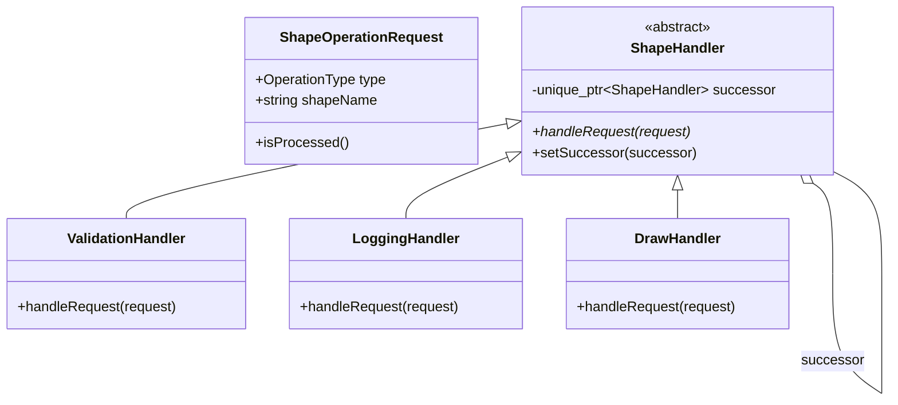
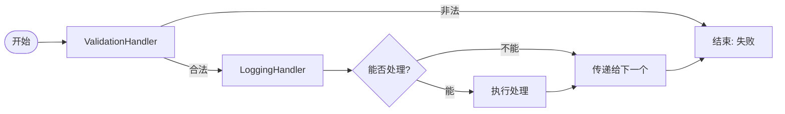

# 职责链模式 (Chain of Responsibility)

## 模式定义
职责链模式是一种行为设计模式，允许将请求沿着处理者链发送。收到请求后，每个处理者均可对请求进行处理，或将其传递给链上的下一个处理者。

## 当前仓库实现概览
本仓库在 `chain_of_responsibility_shapes_fixed.h` 中实现了一个用于图形操作处理的职责链系统。该实现通过 `ShapeHandler` 基类定义了统一的处理接口，并提供了一系列具体的处理者类，支持灵活地组合不同的处理流程（如验证、日志记录、绘制、计算、变换等）。

### 核心类与职责
- **ShapeOperationRequest**: 请求类，封装了操作类型（如 DRAW, ROTATE, SCALE 等）、图形名称及相关参数。
- **ShapeHandler**: 抽象基类，定义了 `handleRequest` 接口和 `successor_`（后继者）指针。
- **具体处理者**:
    - `ValidationHandler`: 验证请求的合法性。
    - `LoggingHandler`: 记录操作日志。
    - `DrawHandler`: 处理图形绘制请求。
    - `AreaCalculationHandler`: 处理面积计算请求。
    - `TransformationHandler`: 处理旋转和缩放请求。
    - `ColorModificationHandler`: 处理颜色修改请求。
    - `StylingHandler`: 处理边框和阴影等样式请求。
- **ShapeHandlerChainBuilder**: 辅助类，用于流式构建处理链。
- **Specialized Chains**: 如 `GraphicsProcessingChain`, `AnimationProcessingChain` 等，预定义的常用处理流程。

## 当前实现如何工作
1. **构建链**: 使用 `ShapeHandlerChainBuilder` 将多个具体的 `ShapeHandler` 实例链接在一起。每个处理者持有指向下一个处理者的 `unique_ptr`。
2. **提交请求**: 客户端创建一个 `ShapeOperationRequest` 并将其传递给链的第一个处理者（Head）。
3. **链式传递**:
    - 如果当前处理者能够处理该请求，则执行相应逻辑。
    - 根据具体实现，处理者可能会停止传递（返回 true），也可能会在处理后继续将请求传递给 `successor_`。
    - 如果当前处理者无法处理，则直接转发给下一个处理者。
    - 如果到达链尾仍未被处理，则返回处理失败。

## Mermaid 图

### 类图 (Static Structure)


### 请求传递流程 (Request Flow)


## 编译与运行
使用仓库中的测试文件 `test_chain_of_responsibility_final.cpp` 进行验证。

### 编译命令
```bash
g++ -O3 -std=c++14 test_chain_of_responsibility_final.cpp -o chain_test
```

### 运行
```bash
./chain_test
```

## 性能/内存分析方法

### 处理开销 (Propagation Cost)
由于职责链涉及虚函数调用和可能的深层递归，当链条极长时，其传播开销可能变得显著。
- **分析方法**: 使用 `std::chrono` 在 `processOperation` 前后记录时间，针对大量请求测量平均延迟。

### 内存分析
本实现使用 `std::unique_ptr` 管理链条生命周期，确保了自动化的资源释放。
- **验证工具**:
```bash
valgrind --leak-check=full ./chain_test
```

## 适用场景与权衡
- **适用场景**:
    - 多个对象可以处理同一请求，但具体由谁处理在运行时确定。
    - 想在不明确指定接收者的情况下向多个对象提交请求。
    - 需要动态指定处理请求的对象集合。
- **权衡**:
    - **优点**: 降低耦合；简化对象，使其无需知道链的结构；增强指派职责的灵活性。
    - **缺点**: 不能保证请求一定被处理（如果链尾未捕获）；在长链中性能可能受影响。
