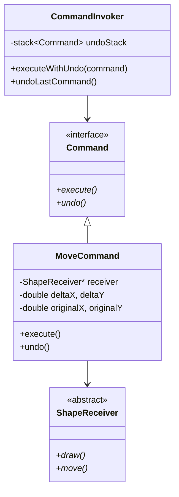
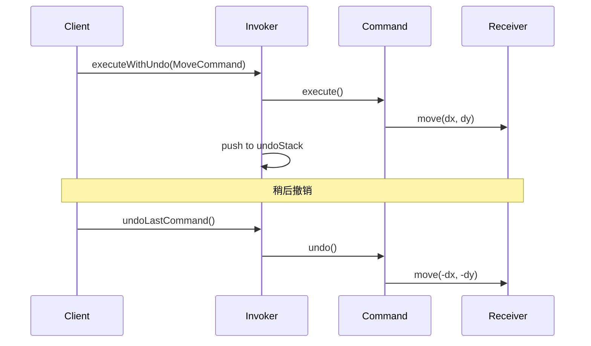

# 命令模式 (Command Pattern)

## 模式定义
命令模式是一种行为设计模式，它将请求封装为一个对象，从而允许用户使用不同的请求、队列或日志请求来参数化其他对象。命令模式也支持可撤销的操作。

## 当前仓库实现概览
本仓库在 `command_patterns.h` 中实现了一个功能丰富的图形操作命令系统。该实现不仅包含了基础的操作封装，还支持撤销（Undo）、宏命令（Macro Command）以及基于函数对象的命令。

### 核心类与职责
- **Command (接口)**: 定义了 `execute()`、`undo()` 和 `getCommandName()` 等核心接口。
- **ShapeReceiver (接收者)**: 执行实际图形操作的类（如 `CircleReceiver`, `RectangleReceiver`）。
- **具体命令 (Concrete Commands)**:
    - `DrawCommand`: 执行绘制操作。
    - `MoveCommand`: 处理图形移动，支持通过记录原始坐标实现撤销。
    - `ResizeCommand`: 处理缩放，支持通过比例计算实现撤销。
    - `ColorChangeCommand`: 处理颜色变更，支持状态回滚。
    - `RotateCommand`: 处理旋转，支持反向旋转撤销。
- **MacroCommand**: 组合模式的应用，允许将多个命令打包成一个序列执行，支持按相反顺序撤销。
- **CommandInvoker / AdvancedCommandInvoker**: 请求者类，负责触发命令执行并维护命令历史/撤销栈。
- **CommandManager**: 管理命令工厂，支持通过名称动态创建命令。

## 当前实现如何工作
1. **封装请求**: 将对 `ShapeReceiver` 的方法调用封装在 `Command` 子类中。
2. **执行与记录**: `Invoker` 接收命令对象，调用其 `execute()` 方法，并将其推入 `executedCommands_` 历史列表。
3. **撤销操作**: 当用户请求 `undoLast()` 时，`Invoker` 从历史记录中弹出最近的一个命令，并调用该命令对象的 `undo()` 方法。
4. **宏录制**: `AdvancedCommandInvoker` 支持在 `beginMacroRecording` 和 `endMacroRecording` 之间捕获所有提交的命令，并生成一个单一的 `MacroCommand`。

## Mermaid 图

### 类图 (Static Structure)


### 命令撤销序列 (Undo Sequence)


## 编译与运行
使用测试文件 `test_command_pattern_final.cpp`。

### 编译命令
```bash
g++ -O3 -std=c++14 test_command_pattern_final.cpp -o command_test
```

### 运行
```bash
./command_test
```

## 性能/内存分析方法

### 命令历史开销
命令模式会存储大量命令对象以支持撤销。
- **分析方法**: 记录 `executedCommands_` 向量的大小。在长时间运行的系统中，建议设置历史记录上限或使用循环缓冲区。

### 内存泄漏检查
由于大量使用 `std::unique_ptr` 和 `std::vector<std::unique_ptr<Command>>`，需重点关注命令对象的生命周期。
- **验证工具**:
```bash
valgrind --leak-check=full --show-leak-kinds=all ./command_test
```

## 适用场景与权衡
- **适用场景**:
    - 需要通过操作来参数化对象。
    - 需要在不同时刻指定、排列和执行请求（队列）。
    - 需要支持撤销/重做操作。
    - 需要支持宏命令。
- **权衡**:
    - **优点**: 将发起操作的对象与执行操作的对象解耦；可以轻松添加新命令而无需修改现有代码。
    - **缺点**: 可能会导致具体的 `Command` 类数量激增。
