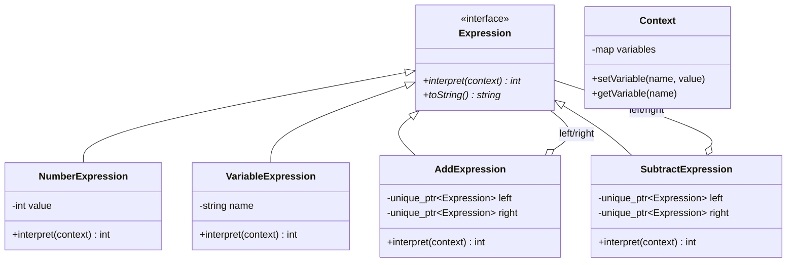
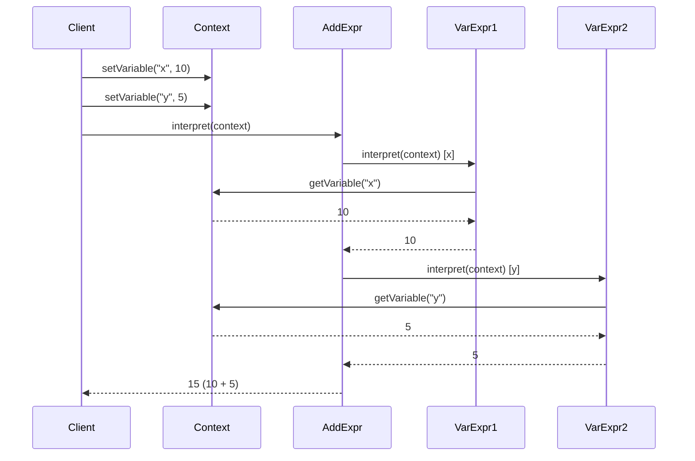

# 解释器模式 (Interpreter Pattern)

## 模式定义
解释器模式为语言定义了一个语法表示，并提供一个解释器来解释该语言中的句子。它适用于需要解释和执行特定语言或表达式的场景。

## 当前仓库实现概览
本仓库在 `interpreter_patterns.h` 中实现了一个表达式求值系统。该实现使用组合模式构建表达式树，支持算术运算（加减乘除）和布尔比较运算（大于、小于）。

### 核心类与职责
- **Context (上下文)**: 存储变量和它们的值，供表达式解释时查询。
- **Expression (表达式接口)**: 定义 `interpret()` 方法和 `toString()` 方法。
- **终结符表达式 (Terminal Expressions)**:
    - `NumberExpression`: 表示数字常量。
    - `VariableExpression`: 表示变量，从上下文中获取值。
- **非终结符表达式 (Non-terminal Expressions)**:
    - `AddExpression`: 加法运算。
    - `SubtractExpression`: 减法运算。
    - `MultiplyExpression`: 乘法运算。
    - `DivideExpression`: 除法运算（包含除零检查）。
    - `GreaterThanExpression`: 大于比较。
    - `LessThanExpression`: 小于比较。
- **ExpressionEvaluator**: 表达式求值器，管理上下文并提供统一的求值接口。

## 当前实现如何工作
1. **构建表达式树**: 通过组合各种表达式对象（如 `AddExpression` 包含两个子表达式）来构建复杂的表达式树。
2. **上下文管理**: `Context` 对象存储所有变量及其当前值。
3. **递归解释**: 调用根表达式的 `interpret()` 方法，它会递归地调用子表达式的 `interpret()` 方法。
4. **错误处理**: 对除零和未定义变量等错误情况进行异常处理。

## Mermaid 图

### 类图 (Static Structure)


### 表达式求值流程 (Expression Evaluation)


## 编译与运行
```bash
g++ -std=c++14 test_interpreter_pattern.cpp -o test_interpreter
./test_interpreter
```

## 适用场景
- 需要解释和执行自定义语法或表达式
- 实现简单的脚本语言或配置文件解析器
- 构建规则引擎或表达式求值器
- 语法相对简单且不经常变化

## 优点
- 易于扩展：添加新表达式类型只需创建新的表达式类
- 语法明确：每个语法规则对应一个类
- 便于实现：使用组合模式构建表达式树很自然
- 易于修改和维护

## 缺点
- 类数量多：每个语法规则需要一个类
- 效率较低：使用递归解释，对复杂语法性能不佳
- 不适合复杂语法：当语法规则很多时，类的数量会急剧增加
- 难以优化：解释器模式的实现方式不利于编译优化

## 实际应用示例
- 正则表达式引擎
- SQL 解析器
- 数学表达式计算器
- 配置文件解析
- 简单的脚本语言解释器
