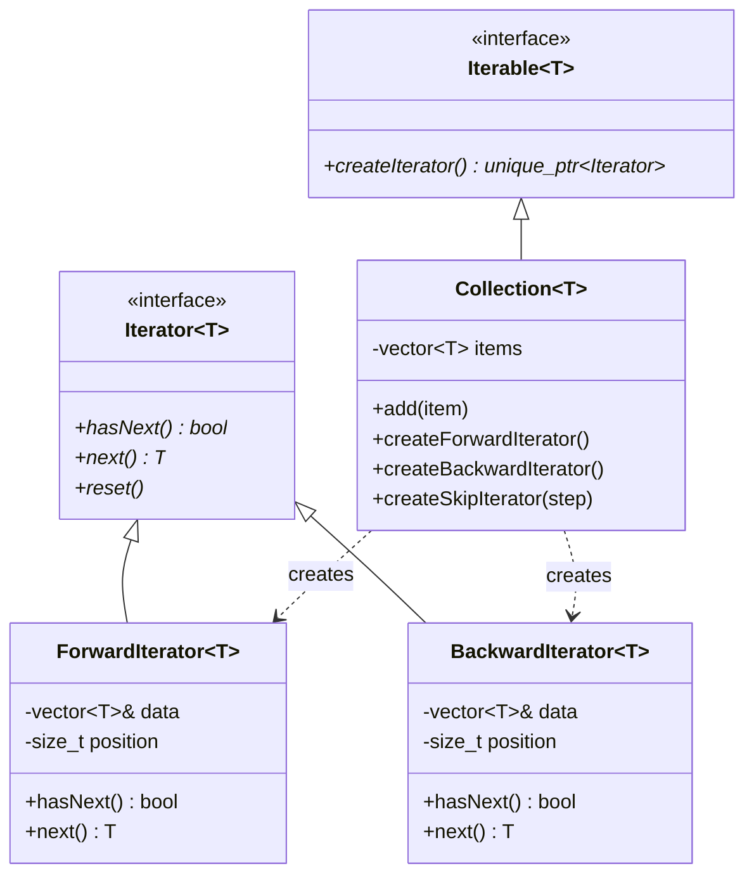
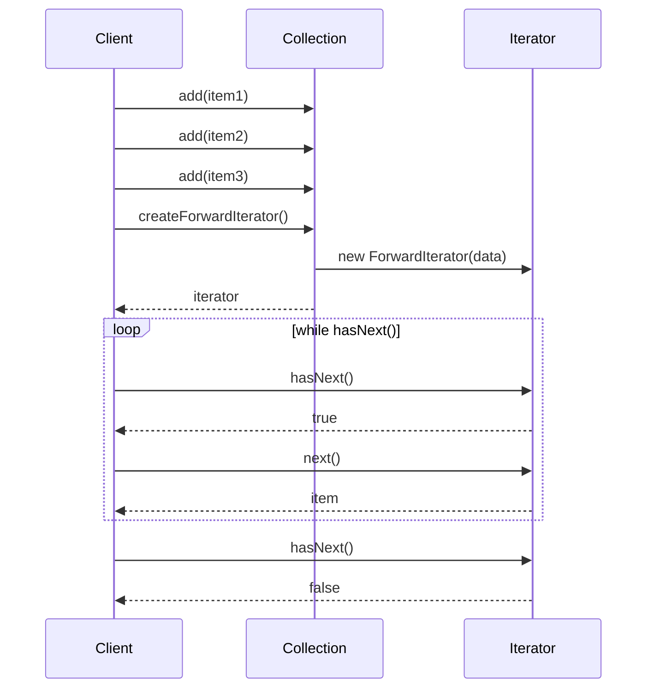

# 迭代器模式 (Iterator Pattern)

## 模式定义
迭代器模式提供一种方法顺序访问一个聚合对象中的各个元素，而又不暴露该对象的内部表示。它将遍历操作从集合对象中分离出来。

## 当前仓库实现概览
本仓库在 `iterator_patterns.h` 中实现了一个灵活的迭代器系统。该实现使用模板支持多种数据类型，并提供了多种遍历策略（正向、反向、跳跃、过滤）。

### 核心类与职责
- **Iterator<T> (迭代器接口)**: 定义了 `hasNext()`、`next()` 和 `reset()` 方法。
- **Iterable<T> (可迭代接口)**: 定义了 `createIterator()` 方法。
- **具体迭代器实现**:
    - `ForwardIterator<T>`: 正向遍历集合。
    - `BackwardIterator<T>`: 反向遍历集合。
    - `SkipIterator<T>`: 按指定步长跳跃遍历。
    - `FilterIterator<T>`: 根据谓词过滤元素。
- **Collection<T>**: 通用集合类，支持多种迭代器类型。
- **BookCollection**: 书籍集合的专用实现示例。

## 当前实现如何工作
1. **迭代器创建**: 集合对象通过工厂方法创建特定类型的迭代器。
2. **状态管理**: 每个迭代器维护自己的遍历位置，互不干扰。
3. **边界检查**: 使用 `hasNext()` 检查是否还有元素可以访问。
4. **异常处理**: 访问超出范围时抛出 `std::out_of_range` 异常。
5. **重置功能**: `reset()` 方法允许迭代器回到初始位置重新遍历。

## Mermaid 图

### 类图 (Static Structure)


### 迭代过程 (Iteration Process)


## 编译与运行
```bash
g++ -std=c++14 test_iterator_pattern.cpp -o test_iterator
./test_iterator
```

## 适用场景
- 需要访问聚合对象的内容而不暴露其内部表示
- 需要对聚合对象提供多种遍历方式
- 需要为不同的聚合结构提供统一的遍历接口
- 需要同时进行多个遍历

## 优点
- 单一职责：将遍历算法从集合对象中分离
- 支持多种遍历：可以为同一集合提供不同的遍历方式
- 简化集合接口：集合类不需要提供多种遍历方法
- 并发遍历：可以同时使用多个迭代器遍历同一集合
- 统一接口：为不同类型的集合提供统一的遍历接口

## 缺点
- 对于简单集合，使用迭代器可能过于复杂
- 需要额外的迭代器类
- 在某些情况下，直接访问集合可能更高效

## 与 C++ 标准库的关系
C++ 标准库已经提供了完善的迭代器支持：
- `std::begin()` / `std::end()` 函数
- 范围 for 循环（range-based for loop）
- STL 算法库广泛使用迭代器

本实现主要用于教学目的，展示迭代器模式的核心思想。实际项目中应优先使用 C++ 标准库的迭代器。

## 实际应用示例
- 遍历容器（vector、list、set、map）
- 数据库结果集遍历
- 文件系统目录遍历
- 树和图的遍历算法
- XML/JSON 文档节点遍历
