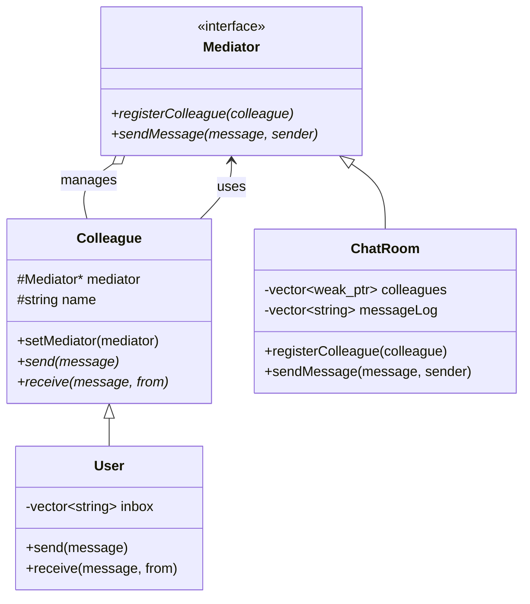
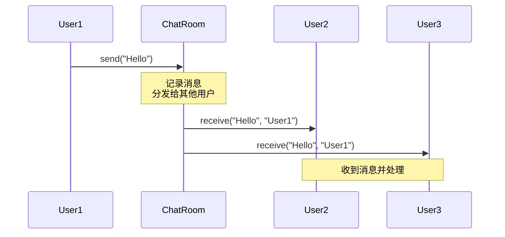
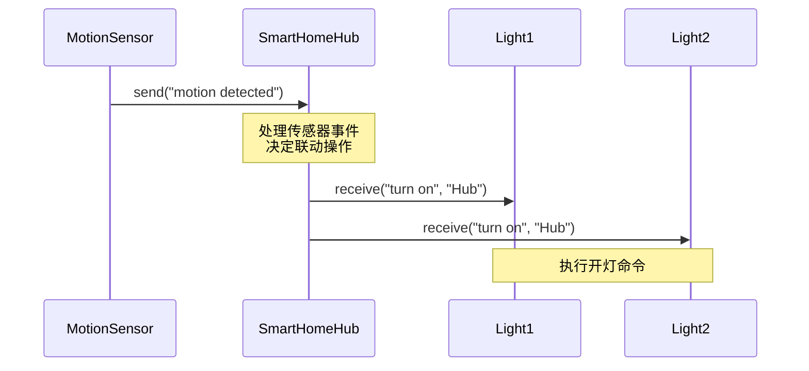

# 中介者模式 (Mediator Pattern)

## 模式定义
中介者模式定义一个对象来封装一系列对象的交互方式。中介者使各对象不需要显式地相互引用，从而使其耦合松散，而且可以独立地改变它们之间的交互。

## 当前仓库实现概览
本仓库在 `mediator_patterns.h` 中实现了多个中介者系统。该实现展示了中介者如何协调多个对象之间的通信，包括聊天室、空中交通管制和智能家居系统三个实际场景。

### 核心类与职责
- **Mediator (中介者接口)**: 定义 `registerColleague()` 和 `sendMessage()` 方法。
- **Colleague (同事类)**: 通过中介者与其他同事通信。
- **具体中介者实现**:
    - `ChatRoom`: 聊天室中介者，广播消息给所有用户（除发送者外）。
    - `AirTrafficControl`: 空中交通管制中介者，协调飞机间的通信。
    - `SmartHomeHub`: 智能家居中心，协调各种设备的联动。
- **具体同事类**:
    - `User`: 聊天室用户。
    - `Aircraft`: 飞机。
    - `SmartDevice`: 智能设备。

## 当前实现如何工作
1. **注册机制**: 同事对象在创建后向中介者注册，中介者使用 `weak_ptr` 存储以避免循环引用。
2. **消息路由**: 同事通过中介者发送消息，中介者决定如何分发消息。
3. **自动清理**: 使用 `weak_ptr` 管理同事对象，已销毁的对象会被自动清理。
4. **协调逻辑**: 中介者可以实现复杂的协调逻辑，如智能家居中的设备联动。

## Mermaid 图

### 类图 (Static Structure)


### 消息传递流程 (Message Flow)


### 智能家居联动 (Smart Home Automation)


## 编译与运行
```bash
g++ -std=c++14 test_mediator_pattern.cpp -o test_mediator
./test_mediator
```

## 适用场景
- 一组对象以定义良好但复杂的方式进行通信
- 想要定制一个分布在多个类中的行为，而又不想生成太多子类
- 一个对象引用其他很多对象并且直接与这些对象通信，导致难以复用该对象
- 想通过一个中间类来封装多个类中的行为，同时又不想生成太多子类

## 优点
- 降低耦合：同事对象之间不需要相互引用
- 集中控制：交互逻辑集中在中介者中，便于理解和维护
- 简化对象协议：对象之间的多对多关系变成了一对多关系
- 独立变化：同事类和中介者可以独立变化和复用

## 缺点
- 中介者复杂化：所有交互逻辑都集中在中介者中，可能使中介者变得庞大而复杂
- 难以维护：当同事类很多时，中介者会变得难以维护
- 性能影响：所有通信都通过中介者，可能成为性能瓶颈

## 与其他模式的关系
- **观察者模式**: 中介者使用观察者模式来通知同事对象
- **外观模式**: 中介者和外观都封装现有类的功能，但中介者的目的是协调同事对象之间的交互，而外观只提供简化接口
- **单例模式**: 中介者通常实现为单例

## 实际应用示例
- GUI 对话框中组件间的交互
- 聊天室/群聊系统
- 空中交通管制系统
- 智能家居自动化
- MVC 架构中的 Controller
- 消息队列系统
