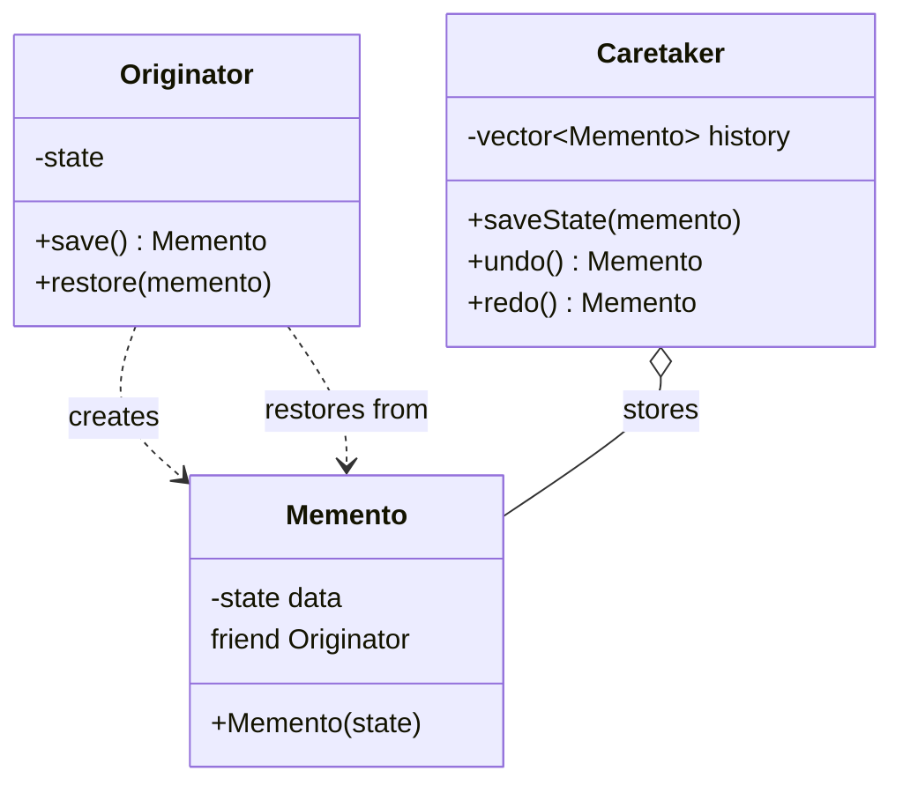
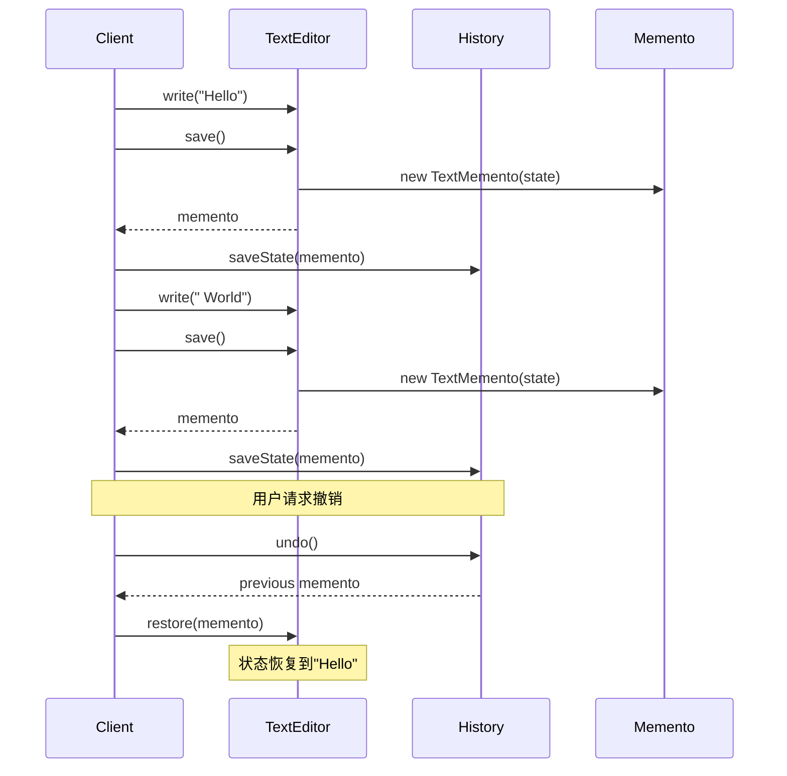
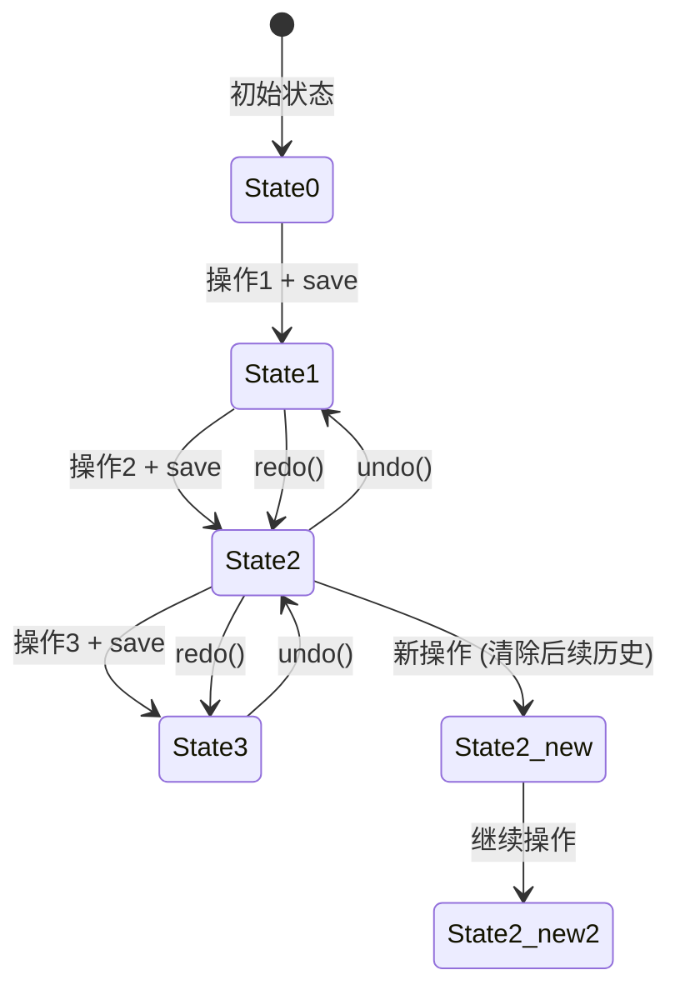

# 备忘录模式 (Memento Pattern)

## 模式定义
备忘录模式在不破坏封装性的前提下，捕获一个对象的内部状态，并在该对象之外保存这个状态，以便以后可以将该对象恢复到原先保存的状态。

## 当前仓库实现概览
本仓库在 `memento_patterns.h` 中实现了多个备忘录系统。该实现展示了如何保存和恢复对象状态，支持撤销/重做功能、游戏存档和绘图快照等场景。

### 核心类与职责
- **Memento (备忘录)**: 存储原发器的内部状态，对外部不透明。
    - `TextMemento`: 存储文本编辑器状态。
    - `GameStateMemento`: 存储游戏状态。
    - `CanvasMemento`: 存储画布状态。
- **Originator (原发器)**: 创建备忘录和从备忘录恢复状态。
    - `TextEditor`: 文本编辑器，支持内容和光标位置。
    - `Game`: 游戏对象，包含等级、分数、生命值。
    - `Canvas`: 画布对象，管理图形列表。
- **Caretaker (管理者)**: 负责保存和管理备忘录。
    - `EditorHistory`: 管理编辑历史，支持撤销/重做。
    - `GameSaveManager`: 管理游戏存档。

## 当前实现如何工作
1. **状态保存**: 原发器创建包含当前状态的备忘录对象。
2. **状态存储**: 管理者将备忘录保存在历史记录中。
3. **状态恢复**: 通过管理者获取备忘录，原发器从备忘录恢复状态。
4. **撤销/重做**: 使用向量和索引实现历史记录的前后移动。
5. **封装保护**: 备忘录的构造函数是私有的，只有原发器可以创建。

## Mermaid 图

### 类图 (Static Structure)


### 撤销/重做流程 (Undo/Redo Flow)


### 历史记录管理 (History Management)


## 编译与运行
```bash
g++ -std=c++14 test_memento_pattern.cpp -o test_memento
./test_memento
```

## 适用场景
- 需要保存对象的历史状态，以便可以恢复到之前的状态
- 实现撤销/重做功能
- 需要创建对象快照以便后续恢复
- 保存和恢复游戏进度
- 事务处理中的回滚操作

## 优点
- 保护封装：不破坏对象的封装性
- 简化原发器：原发器不需要管理和维护历史版本
- 提供回滚机制：便于实现撤销和恢复功能
- 快照机制：可以在任意时刻保存对象状态

## 缺点
- 内存开销：如果需要频繁创建备忘录，会占用大量内存
- 时间开销：保存和恢复操作可能需要较长时间
- 维护成本：如果原发器状态复杂，维护备忘录类会比较困难

## 实现要点
1. **friend 关键字**: 使用 friend 让备忘录类可以访问原发器的私有成员
2. **不可变性**: 备忘录一旦创建就不应该被修改
3. **智能指针**: 使用 `shared_ptr` 管理备忘录的生命周期
4. **历史管理**: 新操作应该清除当前位置之后的所有历史记录

## 与其他模式的关系
- **命令模式**: 可以使用备忘录来保存命令执行前的状态
- **迭代器模式**: 可以使用备忘录保存迭代器的当前位置
- **原型模式**: 都涉及对象的复制，但目的不同

## 实际应用示例
- 文本编辑器的撤销/重做
- IDE 的代码编辑历史
- 游戏存档系统
- 图形编辑软件的操作历史
- 数据库事务回滚
- 浏览器的后退功能
- 版本控制系统
