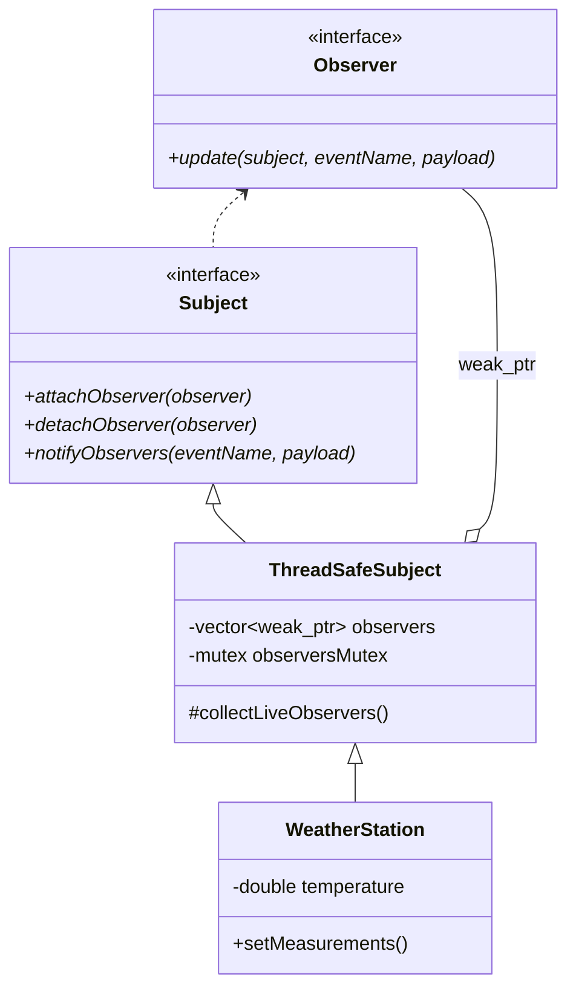
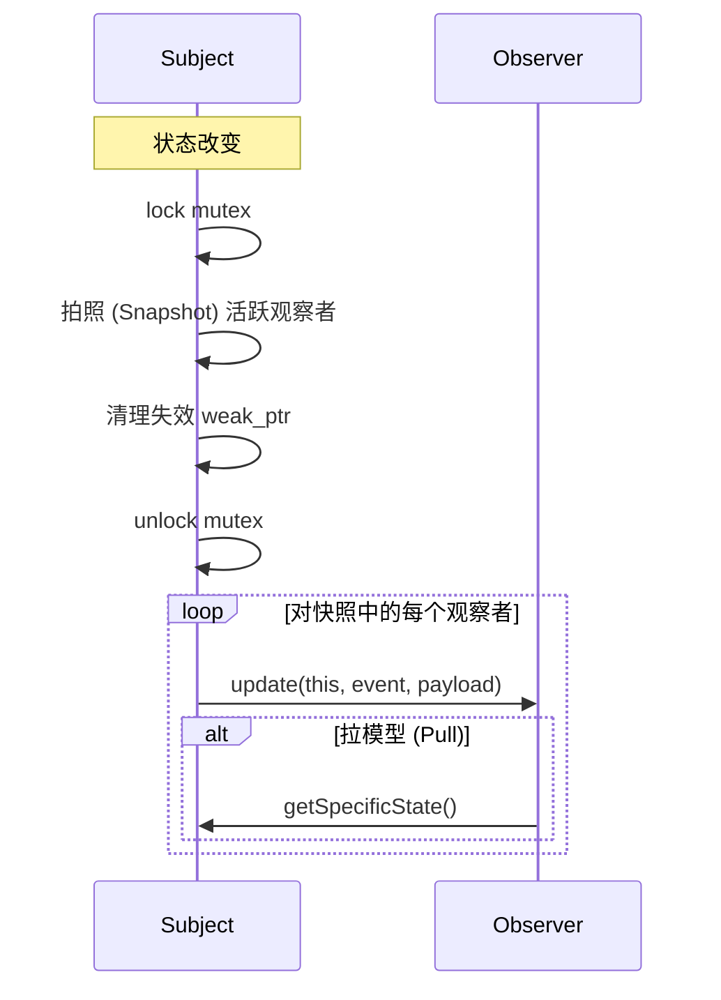

# 观察者模式 (Observer Pattern)

## 模式定义
观察者模式定义了对象间的一种一对多的依赖关系，当一个对象的状态发生改变时，所有依赖于它的对象都得到通知并被自动更新。

## 当前仓库实现概览
本仓库在 `observer_patterns.h` 中实现了一个健壮且线程安全的观察者系统。该实现采用了现代 C++ 特性（如 `std::shared_ptr` 和 `std::weak_ptr`）来管理观察者的生命周期，有效解决了“僵尸观察者”问题，并支持“推”（Push）和“拉”（Pull）两种通知模型。

### 核心类与职责
- **Observer (观察者接口)**: 定义了 `update` 方法。
- **Subject (主体/目标接口)**: 定义了注册、注销和通知观察者的标准接口。
- **ThreadSafeSubject**: 实现了线程安全的主体类，使用 `std::mutex` 保护观察者列表，并利用 `std::weak_ptr` 存储观察者，防止循环引用及无效引用。
- **具体主体 (Concrete Subjects)**:
    - `WeatherStation`: 模拟气象站，当气象数据更新时通知观察者。
    - `EventCenter`: 通用的事件发布中心。
    - `NumericModel`: 封装数值模型，当数值改变时触发更新。
- **具体观察者 (Concrete Observers)**:
    - `WeatherConsoleDisplay`: 推模型示例，直接从负载（payload）获取数据展示。
    - `WeatherStatisticsDisplay`: 拉模型示例，收到通知后通过 `dynamic_cast` 访问主体以获取详细历史数据。
    - `EventLogger`: 记录所有接收到的事件。
    - `ModelValueView`: 监听数值模型变化并渲染视图。

## 当前实现如何工作
1. **线程安全注册**: 观察者通过 `shared_ptr` 注册到主体中。主体内部将其转换为 `weak_ptr` 存储，这样观察者即使不主动注销也能被正常析构。
2. **事件传播**:
    - **推模型**: 主体在调用 `notifyObservers` 时，将事件名称和格式化的数据字符串（payload）直接传递给观察者。
    - **拉模型**: 观察者在 `update` 回调中，通过主体引用反向获取主体的具体状态。
3. **活跃对象清理**: 在每次通知前，`ThreadSafeSubject` 会自动清理那些已经被析构的观察者（`weak_ptr.lock()` 失败的对象），保证列表的纯净。

## Mermaid 图

### 类图 (Static Structure)


### 线程安全通知流程 (Thread-Safe Notification)


## 编译与运行
使用测试文件 `test_observer_pattern.cpp`。

### 编译命令
```bash
g++ -O3 -std=c++14 -pthread test_observer_pattern.cpp -o observer_test
```

### 运行
```bash
./observer_test
```

## 性能/内存分析方法

### 线程安全与锁竞争
由于 `ThreadSafeSubject` 使用了互斥锁，在高并发环境下频繁地注册/注销或通知可能会产生锁竞争。
- **分析方法**: 使用性能分析工具（如 `perf` 或 `gprof`）查看在 `notifyObservers` 中的等待时间。

### 内存管理 (Life-cycle)
本实现的核心优势是使用 `weak_ptr`。
- **验证**: 创建观察者，注册，然后显式重置观察者的 `shared_ptr`。再次调用 `notifyObservers`，应观察到主体自动移除了该失效观察者且无内存泄漏。
- **验证工具**:
```bash
valgrind --leak-check=full ./observer_test
```

## 适用场景与权衡
- **适用场景**:
    - 抽象模型有两方面，其中一方面依赖于另一方面。
    - 对一个对象的改变需要同时改变其他对象，而不知道具体有多少对象有待改变。
    - 一个对象必须通知其他对象，而它又不能假定这些对象是谁。
- **权衡**:
    - **优点**: 主体与观察者之间抽象耦合；支持广播通信。
    - **缺点**: 如果观察者很多，通知所有观察者可能很耗时；如果观察者之间有复杂的依赖，可能导致级联通知甚至死循环（本实现通过单向通知降低了此类风险）。
