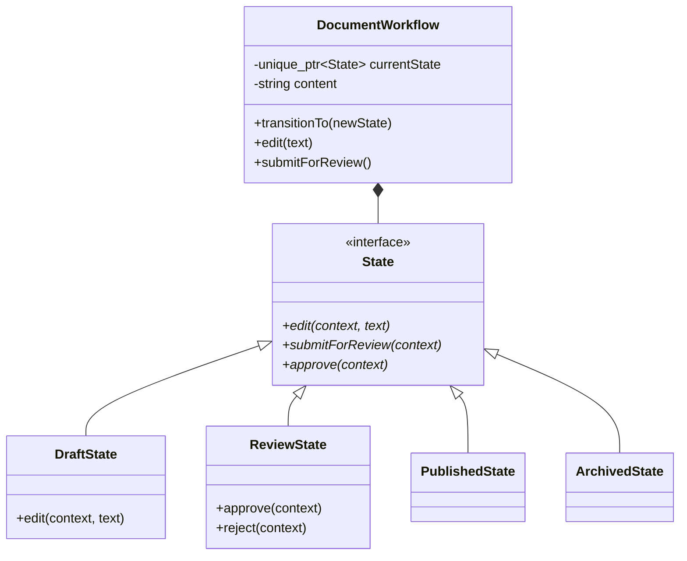
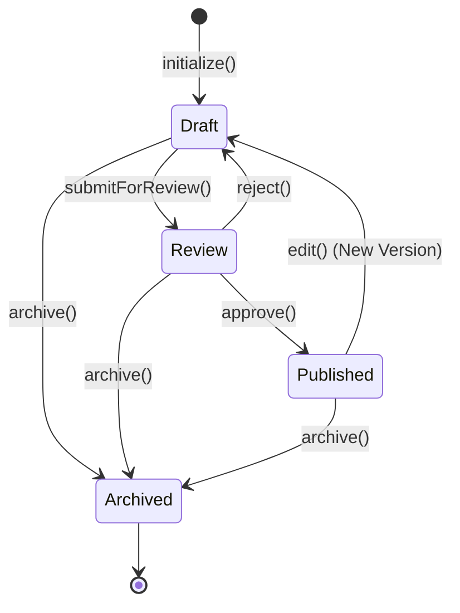

# 状态模式 (State Pattern)

## 模式定义
状态模式是一种行为设计模式，它允许一个对象在其内部状态改变时改变其行为。对象看起来似乎修改了它的类。

## 当前仓库实现概览
本仓库在 `state_patterns.h` 中实现了一个文档工作流（Document Workflow）管理系统。该实现通过将文档的不同阶段（草稿、审核、发布、归档）封装为独立的状态类，实现了行为随状态迁移而自动转换的逻辑。

### 核心类与职责
- **State (状态接口)**: 定义了文档所有可能的操作接口，如 `edit()`、`submitForReview()`、`approve()`、`reject()` 和 `archive()`。
- **DocumentWorkflow (环境类/Context)**: 维护当前的 `State` 实例，并持有文档的元数据（标题、内容、版本等）。它将所有请求委托给当前状态对象处理。
- **具体状态类 (Concrete States)**:
    - `DraftState`: 允许编辑、提交审核或直接归档。
    - `ReviewState`: 禁止直接编辑，允许批准（迁移至发布状态）、拒绝（回退至草稿）或归档。
    - `PublishedState`: 文档已定稿。编辑操作会触发创建新版本并切回草稿状态。
    - `ArchivedState`: 终态。禁止所有编辑和审核操作。

## 当前实现如何工作
1. **委托机制**: `DocumentWorkflow` 不通过大量的 `if-else` 或 `switch` 判断当前状态，而是直接调用 `currentState_->operation(*this)`。
2. **状态迁移**: 具体的 `State` 对象在处理操作时，根据逻辑调用 `context.transitionTo(std::make_unique<NewState>())` 来主动触发状态转换。
3. **行为差异化**: 同一个方法（如 `edit`）在不同状态下有完全不同的表现：在 `Draft` 中是追加内容，在 `Review` 中是被阻塞，在 `Published` 中则是触发版本更新。

## Mermaid 图

### 类图 (Static Structure)


### 状态迁移图 (State Transition)


## 编译与运行
使用测试文件 `test_state_pattern.cpp`。

### 编译命令
```bash
g++ -O3 -std=c++14 test_state_pattern.cpp -o state_test
```

### 运行
```bash
./state_test
```

## 性能/内存分析方法

### 状态对象开销
本实现每次状态转换都会使用 `std::make_unique` 创建新状态。
- **分析方法**: 在状态类的构造和析构函数中添加日志，观察频繁转换时的对象分配频率。对于极高性能要求的场景，可以考虑使用单例模式预分配状态对象，但需注意线程安全。

### 内存管理
- **验证工具**: 确保没有内存泄漏。
```bash
valgrind --leak-check=full ./state_test
```

## 适用场景与权衡
- **适用场景**:
    - 一个对象的行为取决于它的状态，并且它必须在运行时刻根据状态改变它的行为。
    - 操作中含有庞大的多分支结构，且这些分支决定于对象的状态。
- **权衡**:
    - **优点**: 将特定状态相关的行为局部化；使状态转换显式化；消除了臃肿的条件分支语句。
    - **缺点**: 增加了类和对象的数量；状态模式的结构相对复杂。
