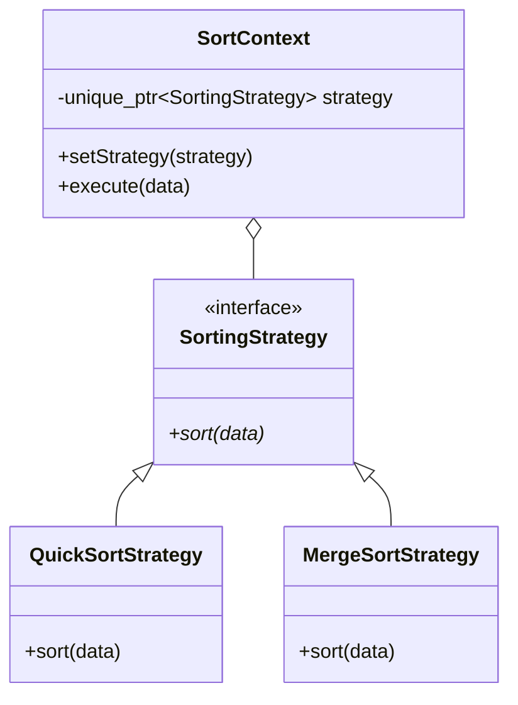
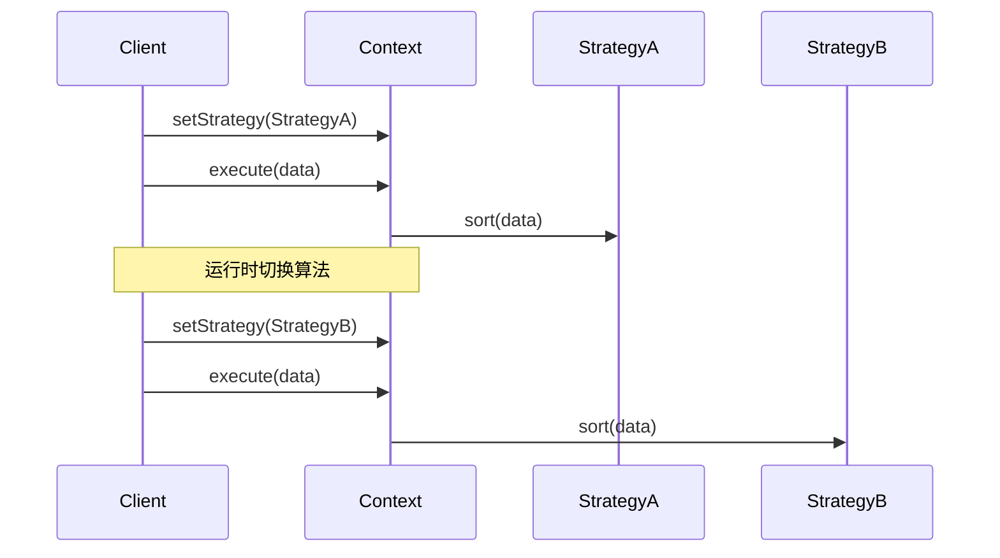

# 策略模式 (Strategy Pattern)

## 模式定义
策略模式是一种行为设计模式，它能让你定义一系列算法，并将每种算法分别放入独立的类中，以使算法的对象能够相互替换。

## 当前仓库实现概览
本仓库在 `strategy_patterns.h` 中提供了策略模式的多种应用场景实现。通过定义统一的策略接口和环境类（Context），支持在运行时动态切换排序算法、定价逻辑、压缩方式以及支付手段。

### 核心类与职责
- **Strategy Interfaces (策略接口)**:
    - `SortingStrategy`: 定义排序接口。
    - `PricingStrategy`: 定义价格计算接口。
    - `CompressionStrategy`: 定义数据压缩接口。
    - `PaymentStrategy`: 定义支付处理接口。
- **Concrete Strategies (具体策略)**:
    - **排序**: `BubbleSortStrategy`, `QuickSortStrategy`, `MergeSortStrategy`。
    - **定价**: `RegularPricingStrategy`, `PercentageDiscountStrategy`, `FlatDiscountStrategy`, `TieredPricingStrategy`。
    - **压缩**: `IdentityCompressionStrategy`, `RunLengthCompressionStrategy`, `VowelRemovalCompressionStrategy`。
    - **支付**: `CreditCardPaymentStrategy`, `PayPalPaymentStrategy`, `CryptoPaymentStrategy`。
- **Context Classes (环境类)**:
    - `SortContext`, `PricingContext`, `CompressionContext`, `PaymentContext`。
    - 职责：持有一个策略对象的指针，并在 `execute()` 方法中调用该策略。支持通过 `setStrategy()` 动态更换算法。

## 当前实现如何工作
1. **接口一致性**: 所有的具体算法类都继承自同一个策略基类，确保了它们在 `Context` 中可以无缝替换。
2. **上下文隔离**: 客户端代码仅与 `Context` 交互，无需了解具体算法的内部细节。
3. **运行时切换**: 通过 `setStrategy` 方法，可以在程序运行过程中根据数据特征（如数组大小、优惠券类型等）灵活选择最合适的算法。

## Mermaid 图

### 类图 (Static Structure)


### 策略切换流程 (Strategy Switching)


## 编译与运行
使用测试文件 `test_strategy_pattern.cpp`。

### 编译命令
```bash
g++ -O3 -std=c++14 test_strategy_pattern.cpp -o strategy_test
```

### 运行
```bash
./strategy_test
```

## 性能/内存分析方法

### 算法性能比较
策略模式非常适合用来对比不同算法的性能。
- **分析方法**: 针对同一组大规模测试数据，分别切换不同的策略（如 `QuickSort` 与 `BubbleSort`），测量执行时间。
- **测量代码示例**:
```cpp
auto start = std::chrono::high_resolution_clock::now();
ctx.execute(largeData);
auto end = std::chrono::high_resolution_clock::now();
```

### 内存占用
某些策略（如 `MergeSort`）可能会申请额外的临时空间。
- **验证工具**: 使用 `valgrind` 监控堆内存峰值。
```bash
valgrind --tool=massif ./strategy_test
```

## 适用场景与权衡
- **适用场景**:
    - 想使用对象中算法的各种变体。
    - 有许多相关的类，仅仅行为有异。
    - 需要隐藏复杂的、与算法相关的数据结构。
    - 一个类定义了多种行为，并且这些行为在这个类的操作中以多个条件语句的形式出现。
- **权衡**:
    - **优点**: 算法可自由切换；避免使用多重条件判断；扩展性好（符合开闭原则）。
    - **缺点**: 客户端必须知道所有的策略类，并自行决定使用哪一个；增加了对象的数目。
