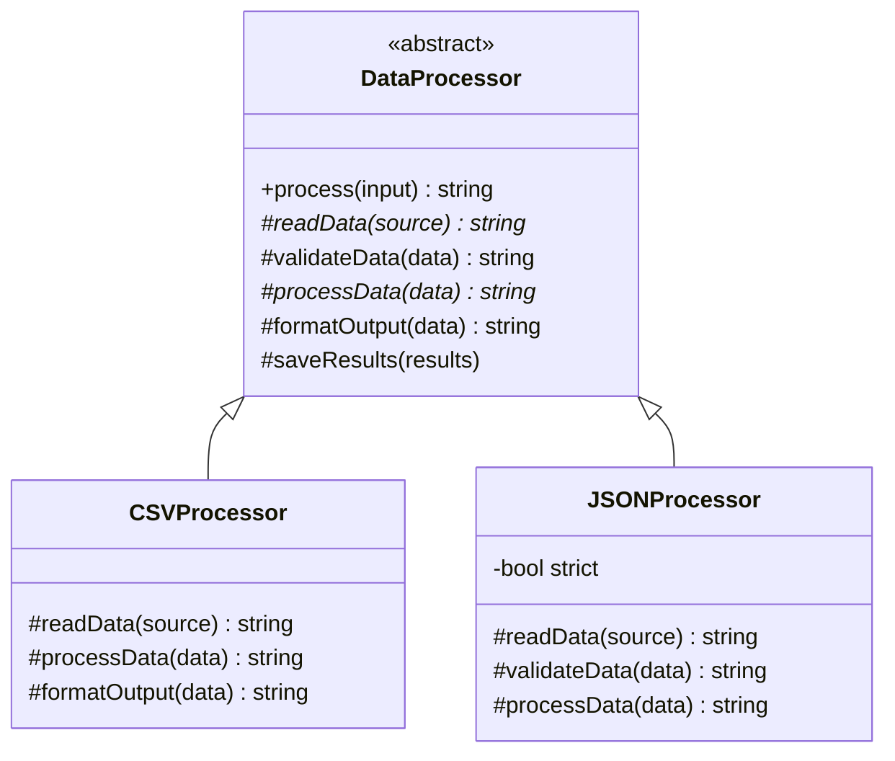
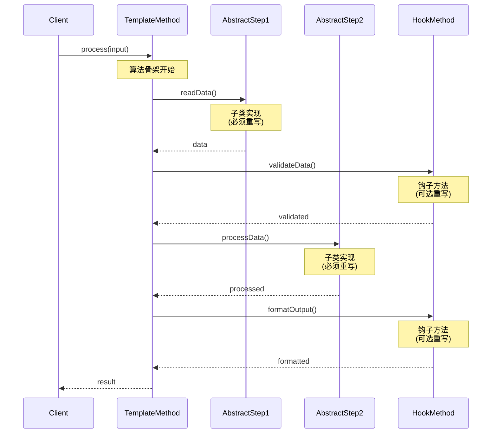
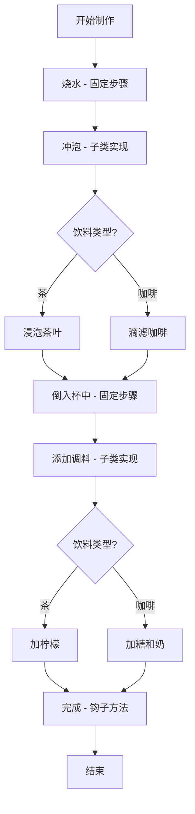

# 模板方法模式 (Template Method Pattern)

## 模式定义
模板方法模式在一个方法中定义一个算法的骨架，而将一些步骤延迟到子类中。模板方法使得子类可以在不改变算法结构的情况下，重新定义算法的某些特定步骤。

## 当前仓库实现概览
本仓库在 `template_method_patterns.h` 中实现了多个模板方法示例。该实现展示了如何定义算法骨架并让子类定制具体步骤，涵盖数据处理、饮料制作、游戏关卡加载和报告生成等场景。

### 核心类与职责
- **Abstract Class (抽象类)**: 定义模板方法和抽象操作。
    - `DataProcessor`: 数据处理流程模板。
    - `Beverage`: 饮料制作流程模板。
    - `LevelLoader`: 游戏关卡加载流程模板。
    - `ReportGenerator`: 报告生成流程模板。
- **Concrete Classes (具体类)**: 实现抽象操作，定制具体步骤。
    - `CSVProcessor`, `JSONProcessor`, `XMLProcessor`: 不同格式的数据处理器。
    - `Tea`, `Coffee`: 不同类型的饮料。
    - `ForestLevel`, `DungeonLevel`: 不同类型的游戏关卡。
    - `HTMLReport`, `TextReport`: 不同格式的报告。

## 当前实现如何工作
1. **模板方法**: 在基类中定义算法的骨架，调用一系列步骤方法。
2. **抽象方法**: 子类必须实现的步骤，使用纯虚函数 `= 0` 声明。
3. **钩子方法**: 子类可以选择性重写的步骤，基类提供默认实现。
4. **不可重写**: 模板方法本身通常不应该被子类重写。

## Mermaid 图

### 类图 (Static Structure)


### 模板方法执行流程 (Template Method Flow)


### 饮料制作流程 (Beverage Preparation)


## 编译与运行
```bash
g++ -std=c++14 test_template_method_pattern.cpp -o test_template_method
./test_template_method
```

## 适用场景
- 一次性实现算法的不变部分，并将可变行为留给子类实现
- 各子类中公共的行为应被提取出来并集中到一个公共父类中以避免代码重复
- 控制子类扩展：模板方法只在特定点调用钩子操作，只允许在这些点进行扩展
- 算法的整体结构不应改变，但某些步骤的实现可以变化

## 优点
- 代码复用：将公共代码提取到父类中
- 符合开闭原则：不修改模板方法就可以扩展算法
- 控制子类扩展：通过钩子方法控制哪些点可以扩展
- 反向控制：父类调用子类的操作（好莱坞原则："Don't call us, we'll call you"）

## 缺点
- 每个不同的实现都需要一个子类
- 增加了系统的复杂性
- 继承带来的固有缺点：子类与父类高度耦合

## 实现要点
1. **final 关键字**: 在 C++11 中可以使用 `final` 防止模板方法被重写
2. **抽象方法**: 使用纯虚函数强制子类实现
3. **钩子方法**: 提供默认实现，子类可选择性重写
4. **访问控制**: 将算法步骤声明为 protected

## 与其他模式的关系
- **策略模式**: 两者都封装算法，但策略模式使用组合而模板方法使用继承
- **工厂方法**: 工厂方法是模板方法的一种特殊情况
- **策略模式 vs 模板方法**: 策略在运行时选择算法，模板方法在编译时确定

## 实际应用示例
- 框架设计（如 GUI 框架的事件处理）
- 数据处理管道
- 单元测试框架（setUp, runTest, tearDown）
- 游戏引擎的游戏循环
- HTTP 请求处理流程
- 编译器的编译流程
