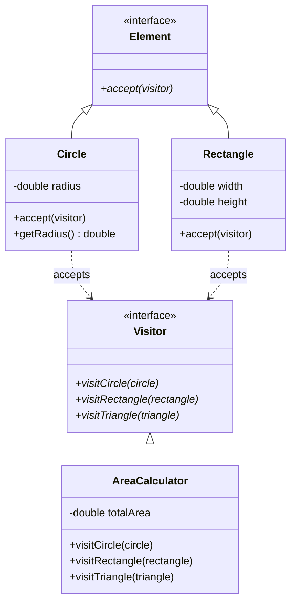
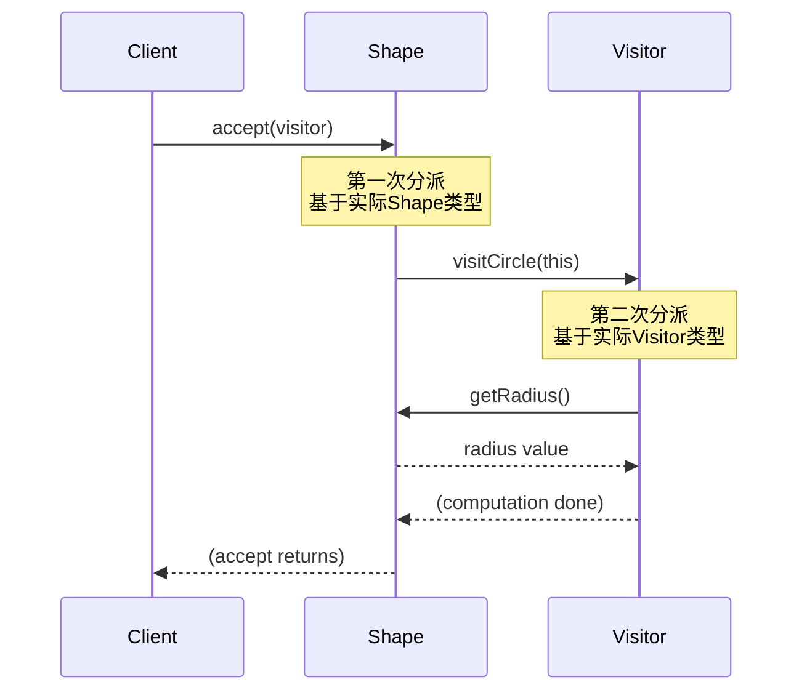
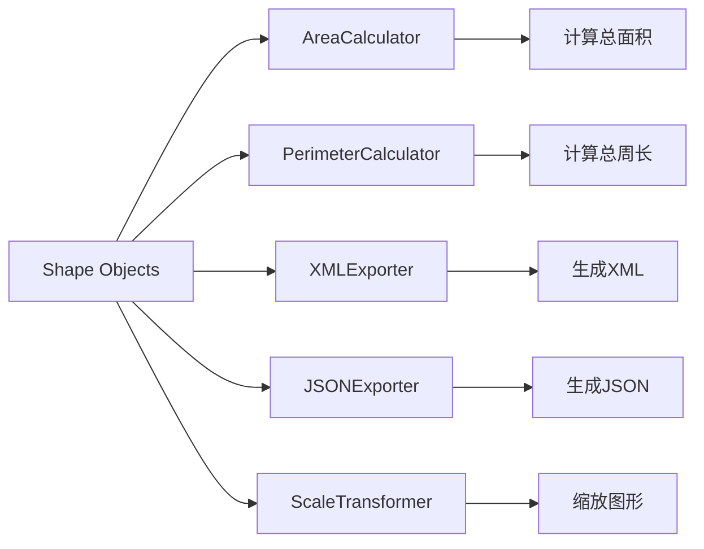

# 访问者模式 (Visitor Pattern)

## 模式定义
访问者模式表示一个作用于某对象结构中的各元素的操作。它使你可以在不改变各元素的类的前提下定义作用于这些元素的新操作。

## 当前仓库实现概览
本仓库在 `visitor_patterns.h` 中实现了一个图形处理系统的访问者模式。该实现展示了如何在不修改图形类的情况下添加新的操作，如面积计算、周长计算、导出和变换等。

### 核心类与职责
- **Visitor (访问者接口)**: 为每种元素类型定义一个访问操作。
    - `ShapeVisitor`: 定义了 `visitCircle()`, `visitRectangle()`, `visitTriangle()` 方法。
- **Element (元素接口)**: 定义 `accept()` 方法接受访问者。
    - `Shape`: 定义了 `accept(visitor)` 方法。
- **Concrete Elements (具体元素)**:
    - `Circle`, `Rectangle`, `Triangle`: 具体的图形类。
- **Concrete Visitors (具体访问者)**:
    - `AreaCalculator`: 计算面积。
    - `PerimeterCalculator`: 计算周长。
    - `XMLExporter`: 导出为 XML 格式。
    - `JSONExporter`: 导出为 JSON 格式。
    - `DrawingRenderer`: 生成绘图命令。
    - `ScaleTransformer`: 缩放图形。
- **Object Structure (对象结构)**:
    - `Drawing`: 管理图形集合并支持访问者遍历。

## 当前实现如何工作
1. **双重分派**: 元素的 `accept()` 方法调用访问者的特定访问方法，实现运行时的类型识别。
2. **访问者遍历**: `Drawing` 对象持有多个图形，可以让访问者遍历所有图形。
3. **状态累积**: 访问者可以在遍历过程中累积状态（如总面积）。
4. **操作分离**: 每个访问者类实现一种操作，便于管理和扩展。

## Mermaid 图

### 类图 (Static Structure)


### 双重分派机制 (Double Dispatch)


### 访问者遍历过程 (Visitor Traversal)
```mermaid
flowchart TD
    A[Drawing: accept(visitor)] --> B{遍历每个Shape}
    B --> C[shape1: accept(visitor)]
    C --> D[visitor.visitCircle(shape1)]
    D --> E[shape2: accept(visitor)]
    E --> F[visitor.visitRectangle(shape2)]
    F --> G[shape3: accept(visitor)]
    G --> H[visitor.visitTriangle(shape3)]
    H --> I{还有更多shape?}
    I -->|是| B
    I -->|否| J[遍历完成]
```

### 多访问者示例 (Multiple Visitors)


## 编译与运行
```bash
g++ -std=c++14 test_visitor_pattern.cpp -o test_visitor
./test_visitor
```

## 适用场景
- 对象结构稳定，但经常需要在此结构上定义新的操作
- 需要对一个对象结构中的对象进行很多不同且不相关的操作
- 类很少改变，但需要经常在类上定义新操作
- 需要避免"污染"元素类的接口

## 优点
- 符合单一职责原则：相关操作集中在访问者中
- 符合开闭原则：添加新操作只需添加新访问者
- 访问者可以累积状态：在遍历过程中收集信息
- 可以跨越类层次结构访问：不受元素类继承关系限制

## 缺点
- 增加新元素类很困难：需要修改所有访问者接口
- 破坏封装：访问者需要访问元素的内部状态
- 具体元素对访问者公开细节：可能违反信息隐藏原则
- 依赖于具体元素类：访问者需要知道所有元素类型

## 实现要点
1. **双重分派**: C++ 的虚函数只支持单分派，访问者模式通过两次方法调用实现双重分派
2. **接口稳定性**: 元素类型应该稳定，避免频繁添加新类型
3. **访问者状态**: 访问者可以维护遍历过程中的状态
4. **对象结构**: 通常配合组合模式使用

## 与其他模式的关系
- **组合模式**: 访问者经常与组合模式一起使用，遍历组合结构
- **迭代器模式**: 可以使用迭代器遍历对象结构，然后应用访问者
- **策略模式**: 访问者是策略模式的扩展，但访问者可以操作多种类型的对象

## 访问者 vs 多态
访问者模式和多态方法的选择：
- **使用多态**：当操作稳定但元素类型经常变化时
- **使用访问者**：当元素类型稳定但操作经常变化时

## 实际应用示例
- 编译器的抽象语法树（AST）处理
- 文档对象模型（DOM）操作
- 图形渲染和导出系统
- 对象序列化/反序列化
- 代码分析和静态检查工具
- 报表生成系统
