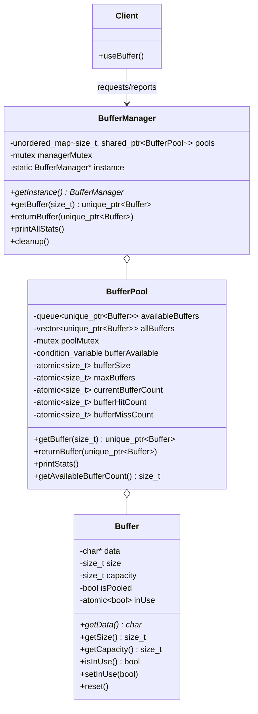
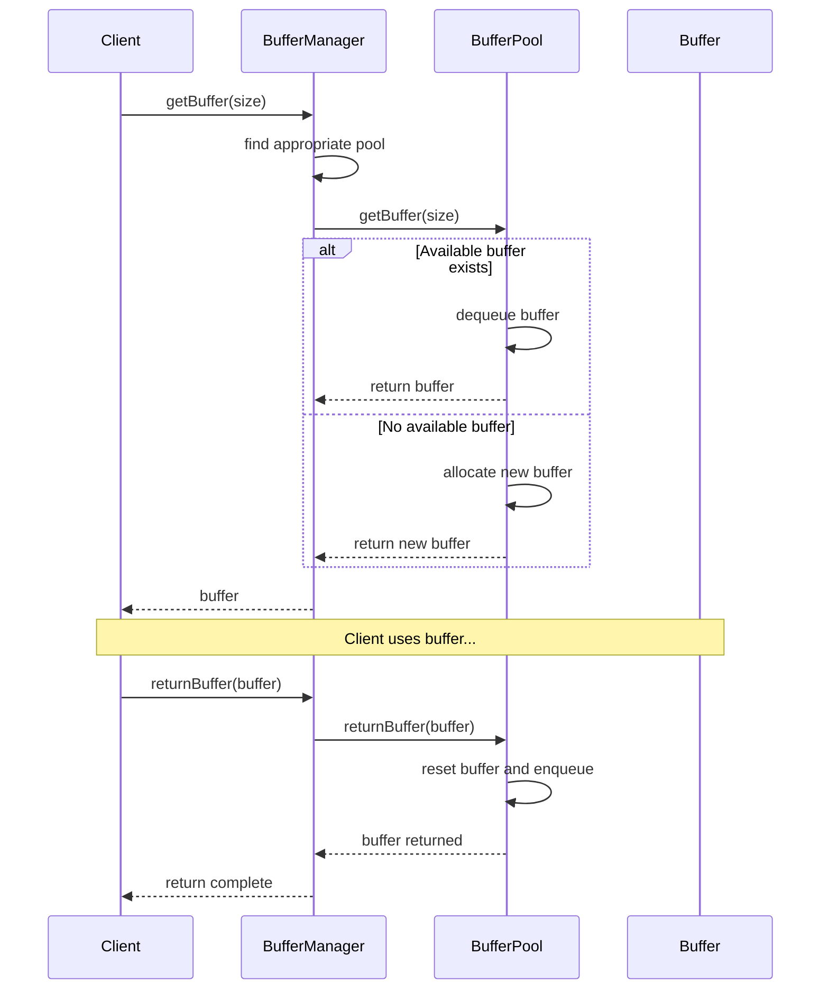
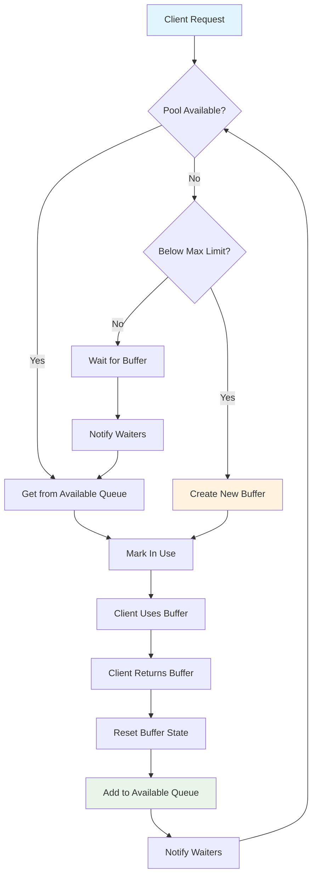
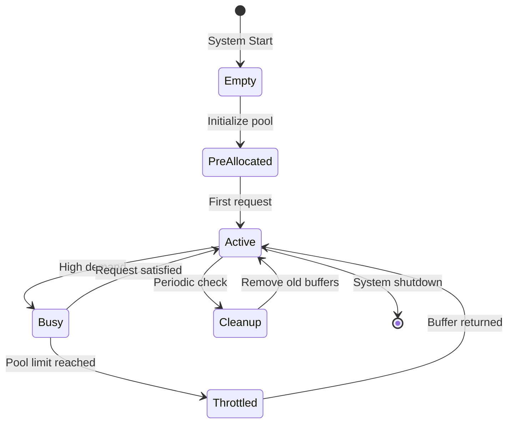
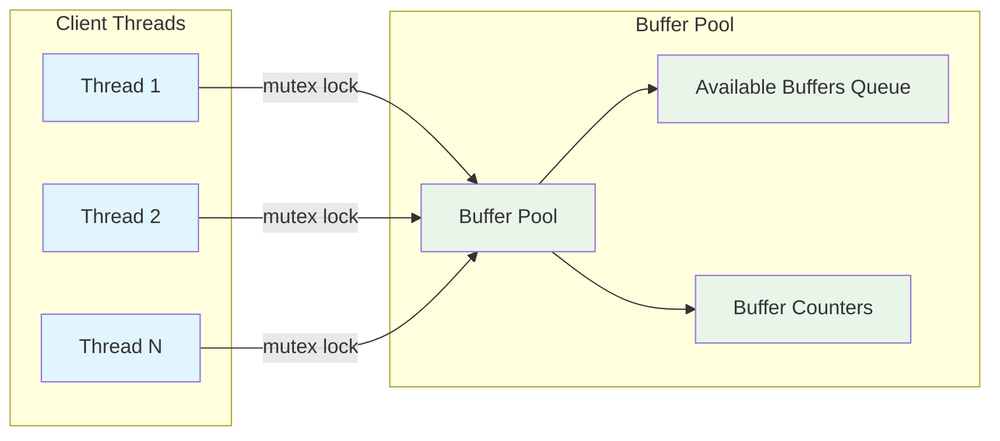

# Buffer Pool Architecture Diagrams

## Class Diagram

```mermaid
classDiagram
    class Buffer {
        -char* data
        -size_t size
        -size_t capacity
        -bool isPooled
        -atomic~bool~ inUse
        +getData() char*
        +getSize() size_t
        +getCapacity() size_t
        +isInUse() bool
        +setInUse(bool)
        +reset()
    }
    
    class BufferPool {
        -queue~unique_ptr~Buffer~~ availableBuffers
        -vector~unique_ptr~Buffer~~ allBuffers
        -mutex poolMutex
        -condition_variable bufferAvailable
        -atomic~size_t~ bufferSize
        -atomic~size_t~ maxBuffers
        -atomic~size_t~ currentBufferCount
        -atomic~size_t~ bufferHitCount
        -atomic~size_t~ bufferMissCount
        +getBuffer(size_t) unique_ptr~Buffer~
        +returnBuffer(unique_ptr~Buffer~)
        +printStats()
        +getAvailableBufferCount() size_t
    }
    
    class BufferManager {
        -unordered_map~size_t, shared_ptr~BufferPool~~ pools
        -mutex managerMutex
        -static BufferManager* instance
        +getInstance() BufferManager*
        +getBuffer(size_t) unique_ptr~Buffer~
        +returnBuffer(unique_ptr~Buffer~)
        +printAllStats()
        +cleanup()
    }
    
    BufferPool o-- Buffer
    BufferManager o-- BufferPool
    
    class Client {
        +useBuffer()
    }
    
    Client --> BufferManager : requests/reports
```

## Sequence Diagram

```mermaid
sequenceDiagram
    participant Client
    participant BufferManager
    participant BufferPool
    participant Buffer
    
    Client->>BufferManager: getBuffer(size)
    BufferManager->>BufferManager: find appropriate pool
    BufferManager->>BufferPool: getBuffer(size)
    alt Available buffer exists
        BufferPool->>BufferPool: dequeue buffer
        BufferPool-->>BufferManager: return buffer
    else No available buffer
        BufferPool->>BufferPool: allocate new buffer
        BufferPool-->>BufferManager: return new buffer
    end
    BufferManager-->>Client: buffer
    Note over Client, Buffer: Client uses buffer...
    Client->>BufferManager: returnBuffer(buffer)
    BufferManager->>BufferPool: returnBuffer(buffer)
    BufferPool->>BufferPool: reset buffer and enqueue
    BufferPool-->>BufferManager: buffer returned
    BufferManager-->>Client: return complete
```

## Flow Diagram

```mermaid
graph TD
    A[Client Request] --> B{Pool Available?}
    B -->|Yes| C[Get from Available Queue]
    B -->|No| D{Below Max Limit?}
    D -->|Yes| E[Create New Buffer]
    D -->|No| F[Wait for Buffer]
    F --> G[Notify Waiters]
    C --> H[Mark In Use]
    E --> H
    G --> C
    H --> I[Client Uses Buffer]
    I --> J[Client Returns Buffer]
    J --> K[Reset Buffer State]
    K --> L[Add to Available Queue]
    L --> M[Notify Waiters]
    M --> B
    style A fill:#e1f5fe
    style L fill:#e8f5e8
    style E fill:#fff3e0
```

## Pool Management

```mermaid
stateDiagram-v2
    [*] --> Empty: System Start
    Empty --> PreAllocated: Initialize pool
    PreAllocated --> Active: First request
    Active --> Busy: High demand
    Busy --> Active: Request satisfied
    Active --> Cleanup: Periodic check
    Cleanup --> Active: Remove old buffers
    Busy --> Throttled: Pool limit reached
    Throttled --> Active: Buffer returned
    Active --> [*]: System shutdown
```

## Thread Safety

```mermaid
graph LR
    subgraph "Client Threads"
        CT1[Thread 1]
        CT2[Thread 2]
        CTN[Thread N]
    end
    
    subgraph "Buffer Pool"
        BP[Buffer Pool]
        BU[Available Buffers Queue]
        BC[Buffer Counters]
    end
    
    CT1 -->|mutex lock| BP
    CT2 -->|mutex lock| BP
    CTN -->|mutex lock| BP
    BP --> BU
    BP --> BC
    
    style CT1 fill:#e1f5fe
    style CT2 fill:#e1f5fe
    style CTN fill:#e1f5fe
    style BP fill:#e8f5e8
    style BU fill:#e8f5e8
    style BC fill:#e8f5e8
```