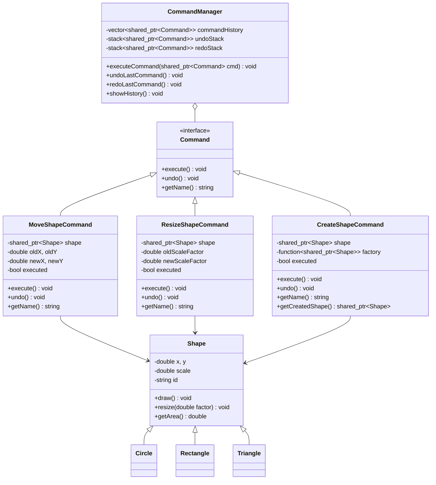
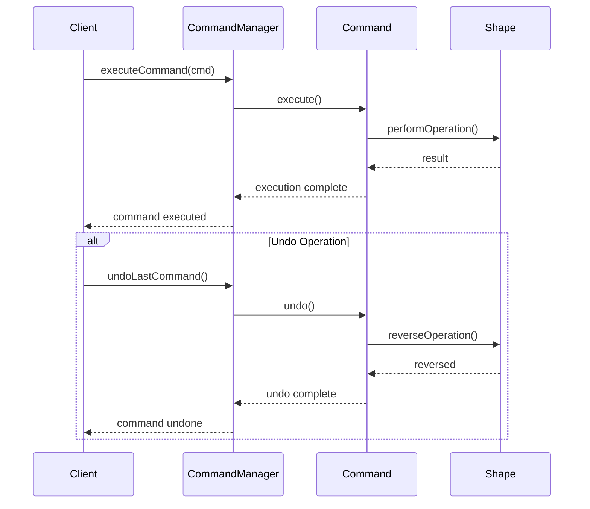
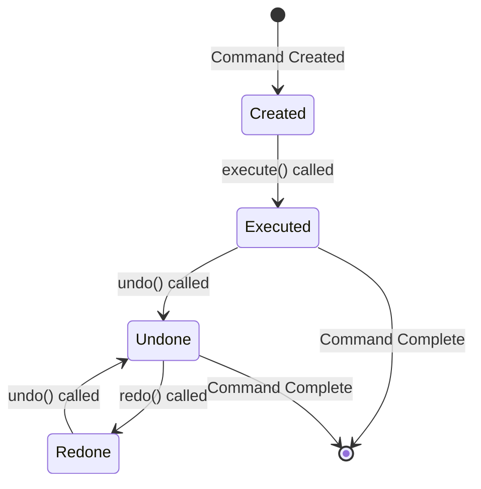
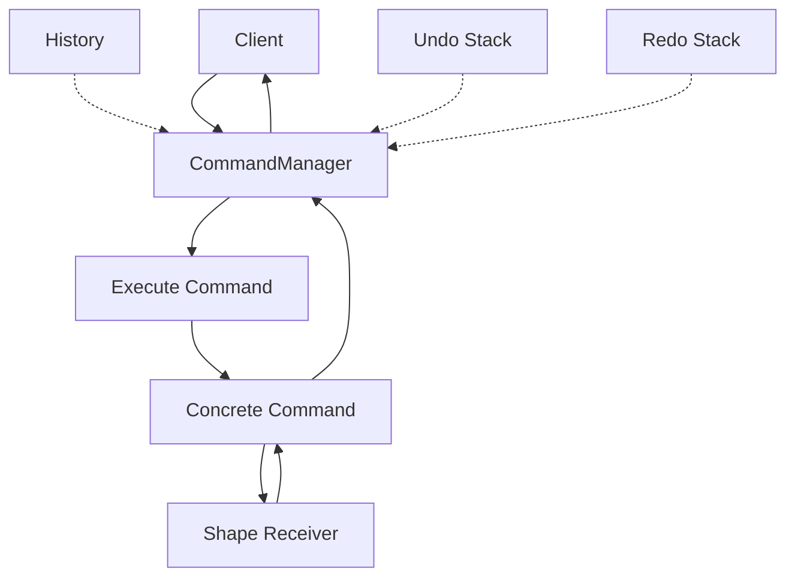

# Command Pattern Architecture Diagrams

## Class Diagram

```mermaid
classDiagram
    class Command {
        <<interface>>
        +execute() void
        +undo() void
        +getName() string
    }
    
    class MoveShapeCommand {
        -shared_ptr~Shape~ shape
        -double oldX, oldY
        -double newX, newY
        -bool executed
        +execute() void
        +undo() void
        +getName() string
    }
    
    class ResizeShapeCommand {
        -shared_ptr~Shape~ shape
        -double oldScaleFactor
        -double newScaleFactor
        -bool executed
        +execute() void
        +undo() void
        +getName() string
    }
    
    class CreateShapeCommand {
        -shared_ptr~Shape~ shape
        -function~shared_ptr~Shape~~ factory
        -bool executed
        +execute() void
        +undo() void
        +getName() string
        +getCreatedShape() shared_ptr~Shape~
    }
    
    class Shape {
        -double x, y
        -double scale
        -string id
        +draw() void
        +resize(double factor) void
        +getArea() double
    }
    
    class CommandManager {
        -vector~shared_ptr~Command~~ commandHistory
        -stack~shared_ptr~Command~~ undoStack
        -stack~shared_ptr~Command~~ redoStack
        +executeCommand(shared_ptr~Command~ cmd) void
        +undoLastCommand() void
        +redoLastCommand() void
        +showHistory() void
    }
    
    Command <|-- MoveShapeCommand
    Command <|-- ResizeShapeCommand
    Command <|-- CreateShapeCommand
    Shape <|-- Circle
    Shape <|-- Rectangle
    Shape <|-- Triangle
    
    MoveShapeCommand --> Shape
    ResizeShapeCommand --> Shape
    CreateShapeCommand --> Shape
    CommandManager o-- Command
```

## Sequence Diagram

```mermaid
sequenceDiagram
    participant Client
    participant CommandManager
    participant Command
    participant Shape
    
    Client->>CommandManager: executeCommand(cmd)
    CommandManager->>Command: execute()
    Command->>Shape: performOperation()
    Shape-->>Command: result
    Command-->>CommandManager: execution complete
    CommandManager-->>Client: command executed
    
    alt Undo Operation
        Client->>CommandManager: undoLastCommand()
        CommandManager->>Command: undo()
        Command->>Shape: reverseOperation()
        Shape-->>Command: reversed
        Command-->>CommandManager: undo complete
        CommandManager-->>Client: command undone
    end
```

## Command Flow State Diagram

```mermaid
stateDiagram-v2
    [*] --> Created: Command Created
    Created --> Executed: execute() called
    Executed --> Undone: undo() called
    Undone --> Redone: redo() called
    Redone --> Undone: undo() called
    Executed --> [*]: Command Complete
    Undone --> [*]: Command Complete
```

## Component Interaction

```mermaid
graph TD
    A[Client] --> B[CommandManager]
    B --> C[Execute Command]
    C --> D[Concrete Command]
    D --> E[Shape Receiver]
    E --> D
    D --> B
    B --> A
    
    F[History] -.-> B
    G[Undo Stack] -.-> B
    H[Redo Stack] -.-> B
```