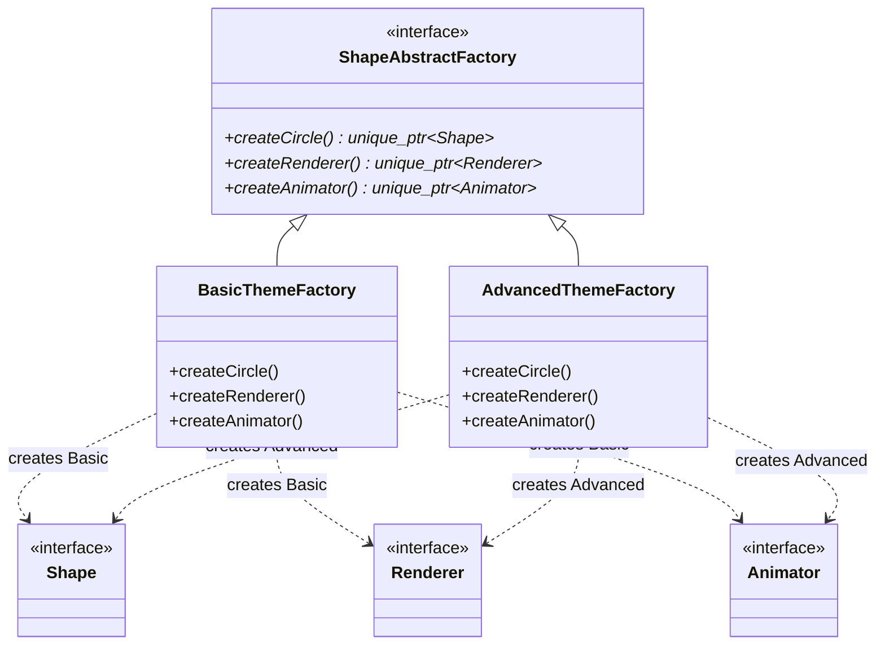
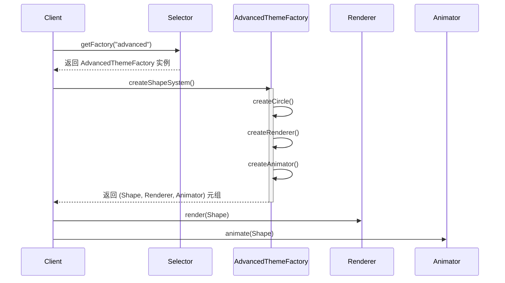

# 抽象工厂模式 (Abstract Factory Pattern)

## 模式定义
抽象工厂模式是一种创建型设计模式，它能创建一系列相关或相互依赖的对象，而无需指定其具体类。通过使用抽象工厂，客户端可以确保从工厂获得的对象始终是彼此兼容的。

## 当前仓库实现概览
本仓库在 `abstract_factory_shapes.h` 中实现了一个图形系统方案，该方案不仅包含图形本身（Shape），还包含与其配套的渲染器（Renderer）和动画器（Animator）。

引用文件：
- `abstract_factory_shapes.h`: 模式实现与产品簇定义
- `test_abstract_factory.cpp`: 测试与演示程序

### 产品簇成员
本实现定义了三个产品接口及其在不同主题下的具体实现：
1.  **Shape (图形)**: 如 `BasicCircle`, `BasicRectangle` 等。
2.  **ShapeRenderer (渲染器)**: 如 `BasicShapeRenderer`, `AdvancedShapeRenderer` 等。
3.  **ShapeAnimator (动画器)**: 如 `BasicShapeAnimator`, `SmoothShapeAnimator` 等。

### 工厂变体 (主题)
-   **BasicThemeFactory**: 创建基础款图形、标准渲染器和基础动画器。
-   **AdvancedThemeFactory**: 创建略大的图形、高级渲染器（带阴影）和丝滑动画器。
-   **ModernThemeFactory**: 创建现代风格图形、高级渲染器和丝滑动画器。
-   **VintageThemeFactory**: 创建复古风格图形、标准渲染器和慢速动画器。

## 核心类与职责
| 类名 | 职责 |
| :--- | :--- |
| `ShapeAbstractFactory` | 抽象工厂接口，定义创建图形、渲染器和动画器的方法 |
| `BasicThemeFactory` 等 | 具体工厂，负责生产特定主题下的兼容产品系列 |
| `ShapeSystemClient` | 客户端，持有抽象工厂引用，负责组建和运行图形系统 |
| `AbstractFactorySelector` | 静态辅助类，根据主题名称返回对应的工厂实例 |

## 当前实现如何工作
1.  **兼容性保证**: 客户端通过 `ShapeAbstractFactory` 创建产品。由于具体工厂（如 `AdvancedThemeFactory`）内部逻辑确保了返回的渲染器和动画器适合处理其创建的图形，因此避免了产品不匹配的问题。
2.  **解耦**: 客户端代码 `ShapeSystemClient` 仅依赖于抽象接口。更换整个产品系列（主题）只需切换工厂实例，无需修改客户端逻辑。
3.  **系统构建**: 提供了 `createShapeSystem` 方法，一键生成包含图形、渲染器和动画器的完整元组。

## Mermaid 图

### 类图结构


### 系统组建顺序图


## 编译与运行
使用以下命令编译并运行抽象工厂演示程序：

```bash
# 编译
g++ -std=c++14 test_abstract_factory.cpp -o abstract_factory_demo

# 运行
./abstract_factory_demo
```

## 性能/内存分析方法

### 性能分析 (Profiling)
抽象工厂涉及多层虚函数调用。
- 使用 `valgrind --tool=callgrind` 跟踪函数调用开销：
  ```bash
  valgrind --tool=callgrind ./abstract_factory_demo
  kcachegrind callgrind.out.<pid>  # 如果有图形界面
  ```
- 重点查看 `createShapeSystem` 中三个子产品创建过程的相对耗时。

### 内存分析 (Memory Analysis)
检查工厂频繁切换时是否有内存泄漏：
```bash
valgrind --leak-check=full ./abstract_factory_demo
```
由于实现中广泛使用 `std::unique_ptr`，应能看到完美的内存释放记录。

## 适用场景与权衡
-   **适用场景**:
    - 一个系统不应当依赖于产品类实例如何被创建、组合和表达的细节。
    - 系统中有多个产品系列，而您的系统只消费其中一个系列。
    - 强调一系列相关的产品对象的设计以便联合使用。
-   **权衡**:
    - **优点**: 分离了具体类，使增加或更换主题变得非常容易。
    - **缺点**: 难以支持新种类的产品。如果要在所有主题中增加一个新的产品（如 `ShapeSaver`），需要修改抽象工厂接口及所有具体工厂实现。
