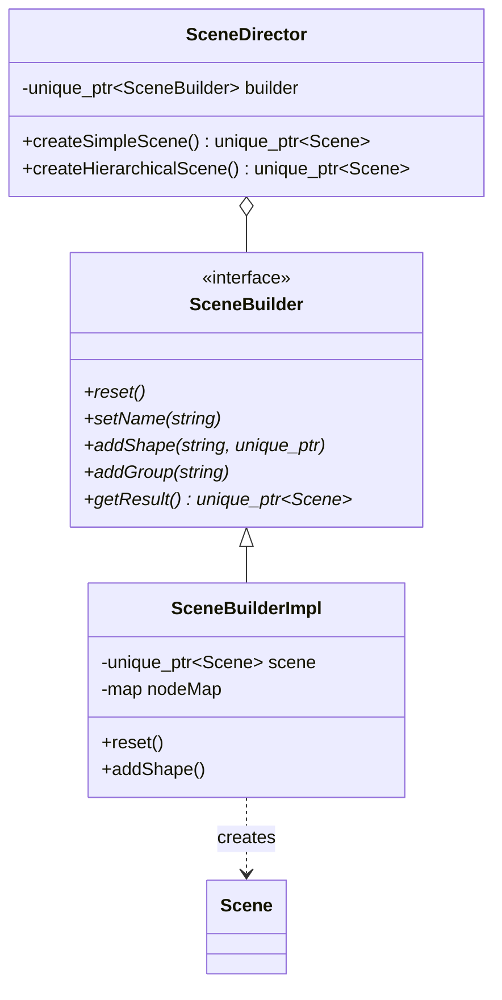
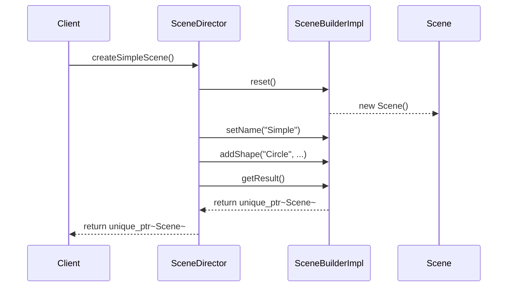

# 生成器模式 (Builder Pattern)

## 模式定义
生成器模式是一种创建型设计模式，使你能够分步骤创建复杂对象。该模式允许你使用相同的创建代码生成不同类型和形式的对象。

## 当前仓库实现概览
本仓库在 `shape_builder.h` 和 `scene_builder.h` 中实现了生成器模式。其中 `shape_builder.h` 展示了基础的对象构建，而 `scene_builder.h` 展示了更复杂的场景图构建。

引用文件：
- `shape_builder.h`: 基础图形生成器实现
- `scene_builder.h`: 高级场景生成器（扩展实现）
- `test_builder_pattern.cpp`: 基础生成器测试
- `test_scene_builder.cpp`: 场景生成器测试

### 核心组成部分
1.  **产品 (Shape / Scene)**: 正在构建的复杂对象。
2.  **生成器接口 (ShapeBuilder / SceneBuilder)**: 声明了构建产品各个部分的通用步骤。
3.  **具体生成器 (CircleBuilder, SceneBuilderImpl)**: 提供构建步骤的具体实现。
4.  **主管 (SceneDirector)**: 定义调用构建步骤的顺序，以创建特定的配置。

## 核心类与职责
| 类名 | 职责 |
| :--- | :--- |
| `ShapeBuilder` | 抽象接口，定义构建图形的方法 |
| `CircleBuilder` | 负责构建 `Circle` 对象的具体生成器，支持链式调用 |
| `SceneBuilder` | 负责构建复杂 `Scene` 对象的抽象接口 |
| `SceneDirector` | 指导 `SceneBuilder` 按特定顺序构建预定义的场景（如 `createComplexScene`） |
| `FluentSceneBuilder` | 包装类，提供更具可读性的流式 API (Fluent Interface) |

## 当前实现如何工作
1.  **分步构建**: 相比于构造函数包含十几个参数，生成器允许通过 `setRadius()`, `setColor()` 等方法逐一设置属性。
2.  **链式调用**: `CircleBuilder` 的方法返回 `this` 指针，支持 `builder->setRadius(5)->setColor("blue")->getResult()` 这种简洁写法。
3.  **复杂结构管理**: 在 `SceneBuilder` 中，生成器不仅设置属性，还管理 `SceneNode` 之间的层级关系（父子节点）。
4.  **主管类封装**: `SceneDirector` 封装了常用的构建算法，客户端只需通过主管类即可获得 "SimpleScene" 或 "SolarSystem" 这种复杂对象。

## Mermaid 图

### 场景生成器类图


### 构建序列图


## 编译与运行
您可以分别编译基础和高级生成器的演示程序：

```bash
# 编译基础生成器
g++ -std=c++14 test_builder_pattern.cpp -o builder_demo
./builder_demo

# 编译场景生成器 (高级扩展)
g++ -std=c++14 test_scene_builder.cpp -o scene_builder_demo
./scene_builder_demo
```

## 性能/内存分析方法

### 性能分析 (Profiling)
生成器模式主要开销在于分步调用带来的额外开销和中间状态存储。
- 使用 `g++ -O3` 观察编译器对链式调用的内联优化情况。
- 使用 `perf` 统计复杂场景（如 `createHierarchicalScene`）中节点插入和 Map 查找的性能占比。

### 内存分析 (Memory Analysis)
由于生成器在构建过程中持有中间产品，需要确保 `getResult()` 之后或生成器销毁时内存能正确释放。
```bash
valgrind --leak-check=full ./scene_builder_demo
```
**提示**: `SceneBuilderImpl` 使用了 `std::map<std::string, SceneNode*>` 来加速节点查找。由于这些是裸指针且指向被 `unique_ptr` 管理的内存，必须确保在 `Scene` 对象销毁后不再访问该 Map。

## 适用场景与权衡
-   **适用场景**:
    - 需要创建具有繁琐构造函数或许多可选参数的对象。
    - 需要创建不同形式的产品，且这些产品构造步骤相似。
    - 构建复杂组合对象（如本例中的场景树）。
-   **权衡**:
    - **优点**: 良好的封装性，代码可读性高（流式 API），解耦了构造代码和表现代码。
    - **缺点**: 为了创建一个对象，需要先创建一个对应的生成器类，增加了代码复杂度。
