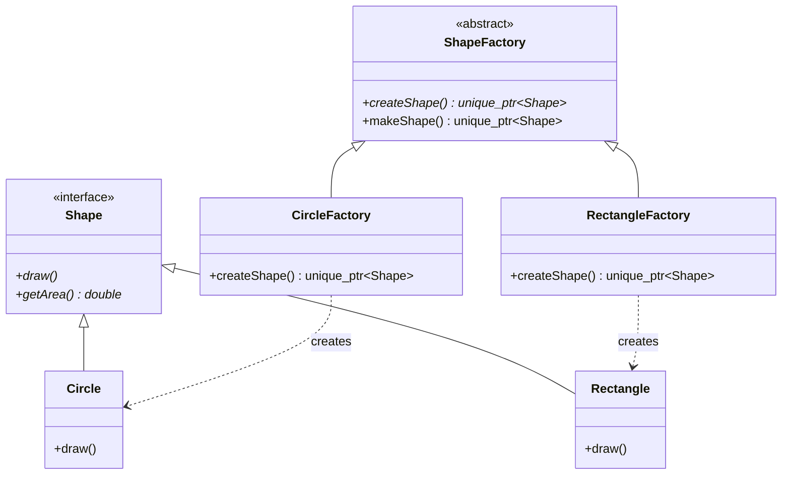
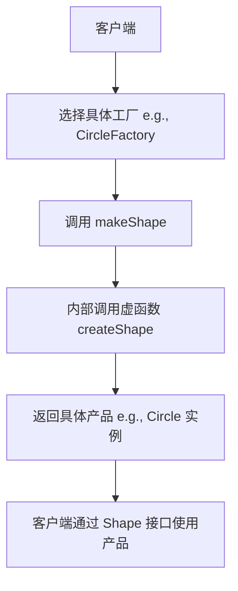

# 工厂方法模式 (Factory Method Pattern)

## 模式定义
工厂方法模式是一种创建型设计模式，它在父类中提供一个创建对象的接口，但允许子类决定实例化哪一个类。工厂方法使一个类的实例化延迟到其子类。

## 当前仓库实现概览
本仓库在 `factory_method_shapes.h` 中通过图形（Shape）及其对应的工厂（ShapeFactory）展示了工厂方法模式的应用。

引用文件：
- `factory_method_shapes.h`: 模式实现与图形定义
- `test_factory_method.cpp`: 测试与演示程序

### 核心组成部分
1.  **产品接口 (Shape)**: 定义了所有具体图形必须实现的通用操作（如 `draw`, `getArea`）。
2.  **具体产品 (Circle, Rectangle, Triangle, Square)**: 实现 `Shape` 接口的具体类。
3.  **创建者 (ShapeFactory)**: 声明了工厂方法 `createShape`。它还可能包含一些依赖于工厂方法的通用逻辑（如 `makeShape`）。
4.  **具体创建者 (CircleFactory, RectangleFactory, etc.)**: 重写工厂方法以返回具体产品的实例。

## 核心类与职责
| 类名 | 职责 |
| :--- | :--- |
| `Shape` | 抽象产品接口，规定图形行为 |
| `Circle` / `Rectangle` | 具体产品，实现具体绘图和面积计算逻辑 |
| `ShapeFactory` | 抽象创建者，定义 `createShape` 虚函数 |
| `CircleFactory` | 具体创建者，负责生产 `Circle` 对象 |
| `ShapeFactoryManager` | 辅助类，演示如何动态切换和使用不同的工厂 |

## 当前实现如何工作
1.  **解耦**: 客户端代码（如 `test_factory_method.cpp`）通过 `ShapeFactory` 接口与具体工厂交互，无需知道具体产品类（如 `Circle`）的构造细节。
2.  **扩展性**: 如果需要增加一种新图形（如 `Pentagon`），只需增加 `Pentagon` 类和 `PentagonFactory` 类，无需修改现有的工厂接口或客户端代码。
3.  **多态创建**: `ShapeFactory::makeShape` 调用虚函数 `createShape`，根据运行时工厂对象的实际类型创建对应的图形。

## Mermaid 图

### 类图结构


### 运行流程图


## 编译与运行
使用以下命令编译并运行工厂方法演示程序：

```bash
# 编译
g++ -std=c++14 test_factory_method.cpp -o factory_method_demo

# 运行
./factory_method_demo
```

## 性能/内存分析方法

### 性能分析 (Profiling)
工厂方法涉及虚函数调用和动态内存分配（`std::make_unique`）。
- 使用 `perf` 工具观察调用栈：
  ```bash
  perf record -g ./factory_method_demo
  perf report
  ```
- 重点关注 `createShape` 的派发开销以及 `new` 操作符的耗时。

### 内存分析 (Memory Analysis)
由于使用了 `std::unique_ptr`，内存管理是自动化的。可以使用 `valgrind` 验证：
```bash
valgrind --leak-check=full ./factory_method_demo
```
该工具将确认所有通过工厂创建的 `Shape` 对象在离开作用域时都已被正确释放。

## 适用场景与权衡
-   **适用场景**:
    - 当一个类不知道它所必须创建的对象的类的时候。
    - 当一个类希望由它的子类来指定它所创建的对象的时候。
    - 当类将创建对象的职责委托给多个帮助子类中的某一个，并且你希望将哪一个帮助子类是代理者这一信息局部化的时候。
-   **权衡**:
    - **优点**: 遵循开闭原则，解耦了产品实现与使用代码。
    - **缺点**: 每增加一个产品，都需要增加一个对应的工厂类，可能会导致类的数量翻倍。
