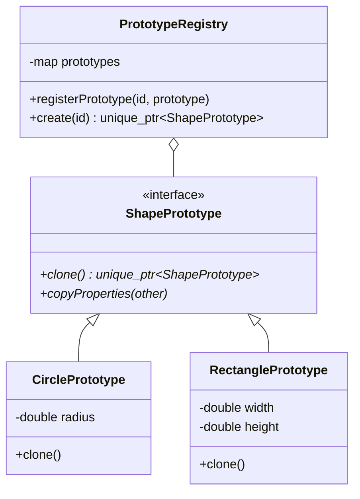
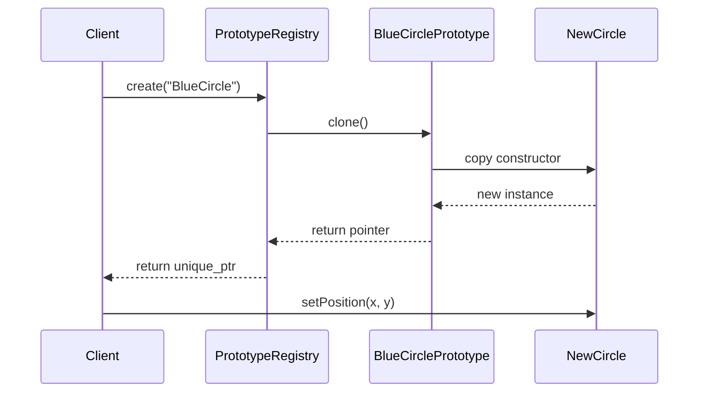

# 原型模式 (Prototype Pattern)

## 模式定义
原型模式是一种创建型设计模式，使你能够通过复制现有对象（即“原型”）来创建新对象，而无需使代码依赖它们所属的类。这种模式在 C++ 中通常通过实现 `clone()` 方法来实现。

## 当前仓库实现概览
本仓库在 `prototype_shapes.h` 中展示了原型模式及其注册表（Registry）的实现。

引用文件：
- `prototype_shapes.h`: 模式实现与原型定义
- `test_prototype_pattern.cpp`: 测试与演示程序

### 核心组成部分
1.  **原型接口 (ShapePrototype)**: 声明克隆方法 `clone()` 和属性复制方法 `copyProperties()`。
2.  **具体原型 (CirclePrototype, RectanglePrototype, etc.)**: 实现 `clone()` 方法，通常利用 C++ 的拷贝构造函数。
3.  **原型注册表 (PrototypeRegistry)**: 提供一种存储、查找和克隆原型的简便方式。
4.  **复杂原型 (ComplexShapePrototype)**: 展示了原型模式在深拷贝组合对象时的应用。

## 核心类与职责
| 类名 | 职责 |
| :--- | :--- |
| `ShapePrototype` | 抽象基类，规定所有形状必须支持 `clone()` |
| `CirclePrototype` | 具体形状原型，通过 `make_unique` 配合拷贝构造函数实现克隆 |
| `ComplexShapePrototype` | 组合形状，克隆时会递归克隆其所有子组件（深拷贝） |
| `PrototypeRegistry` | 存储常用原型（如“蓝色大圆”、“绿色长方形”）并根据 ID 克隆它们 |
| `ShapeFactory` | 结合了注册表和工厂模式，提供静态接口创建形状 |

## 当前实现如何工作
1.  **克隆机制**: 每一个具体产品类都实现了 `clone()`。例如 `CirclePrototype::clone()` 会调用 `std::make_unique<CirclePrototype>(*this)`。由于 C++ 默认提供逐成员拷贝，这能快速生成一个副本。
2.  **避免构造开销**: 如果创建一个形状需要复杂的计算或资源加载，通过 `clone` 一个已有的“标准形状”会比从零构造更快。
3.  **深拷贝**: `ComplexShapePrototype` 在克隆时不仅复制了自己的元数据，还循环调用了所有子组件的 `clone()`，确保副本与原件完全独立。
4.  **注册表解耦**: 客户端不再需要知道 `CirclePrototype` 这个类名，只需向 `PrototypeRegistry` 请求 "BlueCircle" 即可。

## Mermaid 图

### 类图结构


### 克隆流程图


## 编译与运行
使用以下命令编译并运行原型模式演示程序：

```bash
# 编译
g++ -std=c++14 test_prototype_pattern.cpp -o prototype_demo

# 运行
./prototype_demo
```

## 性能/内存分析方法

### 性能分析 (Profiling)
原型模式的性能优势通常体现在复杂对象的复制上。
- 对比 `clone()` 与直接构造（`new` 后逐个赋值）的耗时。
- 使用 `perf` 查看拷贝构造函数的 CPU 占比，确保没有不必要的中间对象产生。

### 内存分析 (Memory Analysis)
原型模式极易出现“浅拷贝”导致的内存问题。
- 使用 `valgrind` 重点检查 `ComplexShapePrototype`：
  ```bash
  valgrind --leak-check=full --show-leak-kinds=all ./prototype_demo
  ```
- 如果副本和原件共享了某些指针而没有正确处理，Valgrind 会报出 "Invalid read" 或 "double free" 错误。当前实现通过 `unique_ptr` 和递归克隆有效避免了此类问题。

## 适用场景与权衡
-   **适用场景**:
    - 需要创建的对象应独立于它们的创建、组合和表达方式时。
    - 要实例化的类是在运行时指定的。
    - 为了避免创建一个与产品类层次平行的工厂类层次时。
    - 当一个类的实例只能有几个不同状态组合中的一种时。建立相应数目的原型并注册它们可能比每次用合适的状态实例化该类更方便。
-   **权衡**:
    - **优点**: 运行时增加和删除产品；改变值以指定新对象；减少子类的构造。
    - **缺点**: 每个子类都必须实现 `clone`。当现有类不具备 `clone` 方法且包含循环引用或不支持拷贝的资源时，实现克隆可能非常困难。
