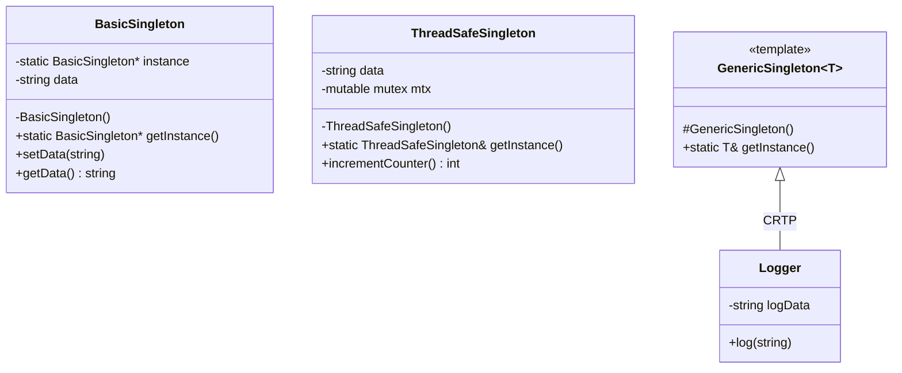
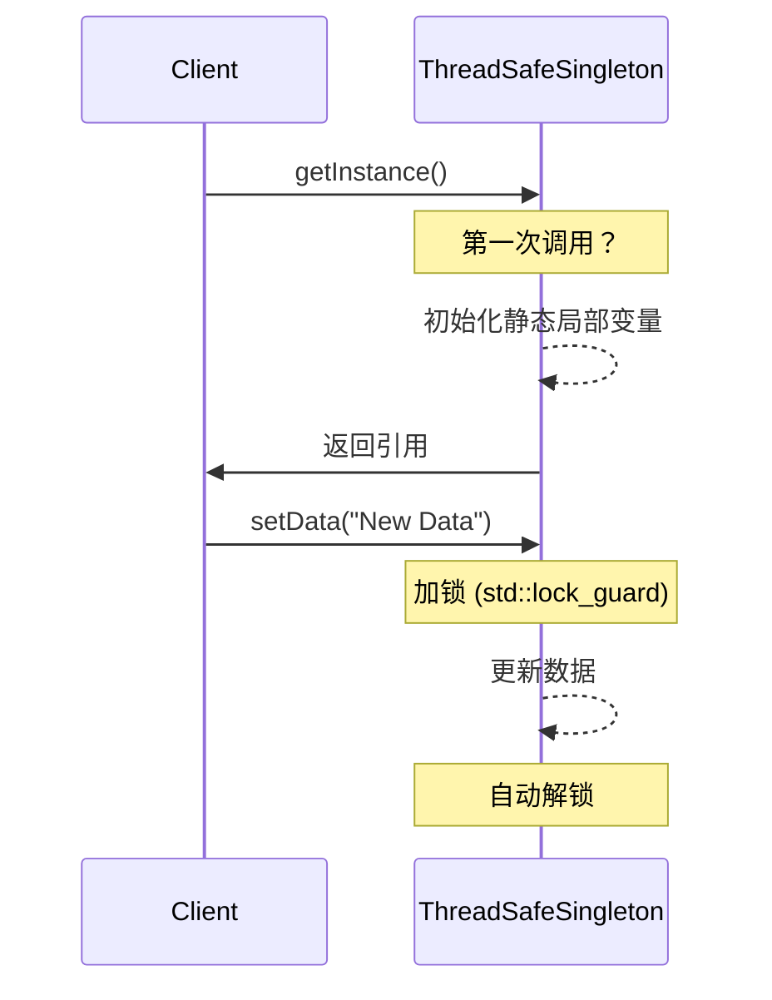

# 单例模式 (Singleton Pattern)

## 模式定义
单例模式是一种创建型设计模式，它确保一个类只有一个实例，并提供一个访问该实例的全局节点。在 C++ 开发中，单例模式常用于管理共享资源（如日志系统、数据库连接池、配置管理器等）。

## 当前仓库实现概览
本仓库在 `singleton_patterns.h` 中实现了多种单例变体，涵盖了从基础实现到线程安全、模板化以及可销毁的多种场景。

引用文件：
- `singleton_patterns.h`: 模式实现
- `test_singleton_pattern.cpp`: 测试与演示程序

### 实现变体
1.  **基础单例 (BasicSingleton)**: 最简单的实现，非线程安全。
2.  **线程安全单例 (ThreadSafeSingleton)**: 使用 C++11 静态局部变量实现的 Meyers 单例，天生线程安全且高效。
3.  **双重检查锁定单例 (DoubleCheckedSingleton)**: 传统的并发优化手段，通过两次检查 `instance` 指针来减少加锁开销。
4.  **延迟初始化单例 (LazyInitSingleton)**: 使用 `std::call_once` 确保实例仅被初始化一次。
5.  **模板化单例 (GenericSingleton<T>)**: 提供通用的单例基类，通过 CRTP (Curiously Recurring Template Pattern) 实现代码复用。
6.  **可销毁单例 (DestroyableSingleton)**: 允许手动释放实例内存，适用于需要精确控制生命周期的场景。

## 核心类与职责
| 类名 | 职责 | 特点 |
| :--- | :--- | :--- |
| `BasicSingleton` | 管理单一实例 | 私有构造，静态指针，非线程安全 |
| `ThreadSafeSingleton` | 线程安全的全局状态管理 | 使用 C++11 静态局部变量，推荐用法 |
| `GenericSingleton<T>` | 为派生类提供单例能力 | 模板基类，减少重复代码 |
| `Logger` / `ConfigManager` | 具体业务单例 | 继承自 `GenericSingleton` |

## 当前实现如何工作
以 `ThreadSafeSingleton` (Meyers Singleton) 为例：
1.  **私有化构造函数**: 防止外部通过 `new` 或直接声明创建对象。
2.  **删除拷贝/赋值**: 确保无法通过拷贝构造或赋值操作产生副本。
3.  **静态局部变量**: 在 `getInstance()` 内部声明 `static ThreadSafeSingleton instance`。根据 C++11 标准，这种初始化是线程安全的。

## Mermaid 图

### 类图结构


### 访问序列图


## 编译与运行
使用 CMake 或直接使用编译器进行编译：

```bash
# 使用 g++ 编译
g++ -std=c++14 -pthread test_singleton_pattern.cpp -o singleton_demo

# 运行演示程序
./singleton_demo
```

## 性能/内存分析方法

### 性能分析 (Profiling)
可以使用 `gprof` 分析单例访问的开销：
1. 编译时加上 `-pg` 标志：`g++ -std=c++14 -pthread -pg test_singleton_pattern.cpp -o singleton_demo_profile`
2. 运行程序产生 `gmon.out`。
3. 生成分析报告：`gprof singleton_demo_profile gmon.out > report.txt`

针对 `test_singleton_pattern.cpp` 中的性能测试部分（1,000,000 次访问），可以重点查看 `ThreadSafeSingleton::getInstance` 的调用耗时。

### 内存分析 (Memory Analysis)
使用 `valgrind` 检查是否存在内存泄漏：
```bash
valgrind --leak-check=full ./singleton_demo
```
**注意**: 很多单例实现（如 `BasicSingleton`）在程序结束时并不显式删除静态指针。在 Valgrind 中，这通常被标记为 "still reachable" 而非 "definitely lost"。如果需要完美清理，请参考 `DestroyableSingleton` 的实现。

## 适用场景与权衡
-   **优点**: 控制资源访问，节省系统开销（避免频繁创建销毁），提供全局唯一访问点。
-   **缺点**: 引入全局状态，增加组件间耦合，可能使单元测试变得困难（状态在测试间残留）。
-   **权衡**: 在 C++11 及更高版本中，优先选择 Meyers Singleton (即仓库中的 `ThreadSafeSingleton` 方式)，因为它简洁且性能优异。
