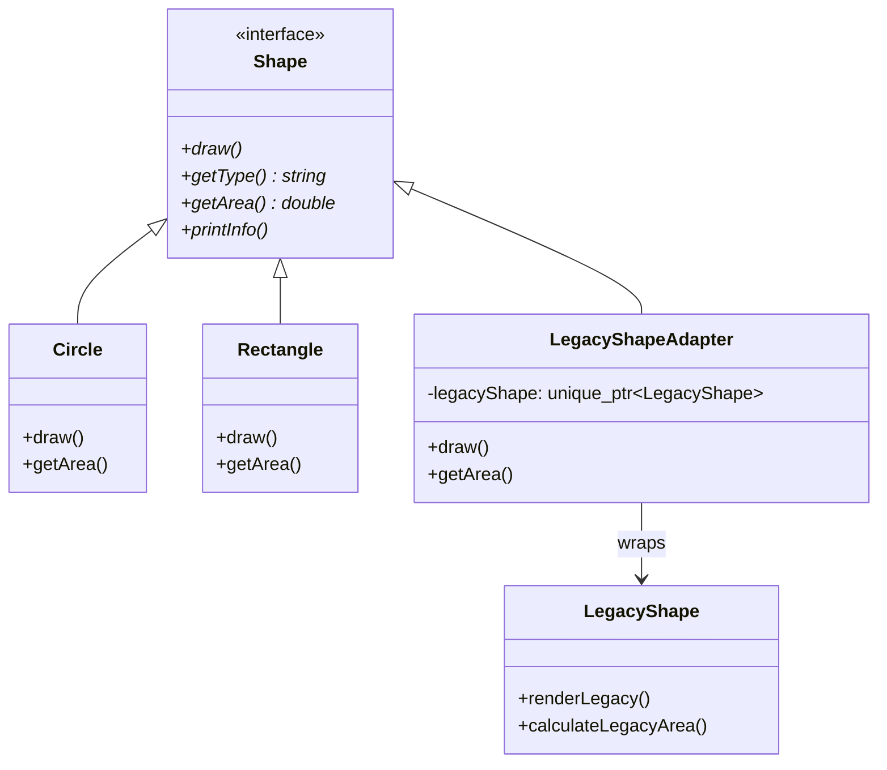
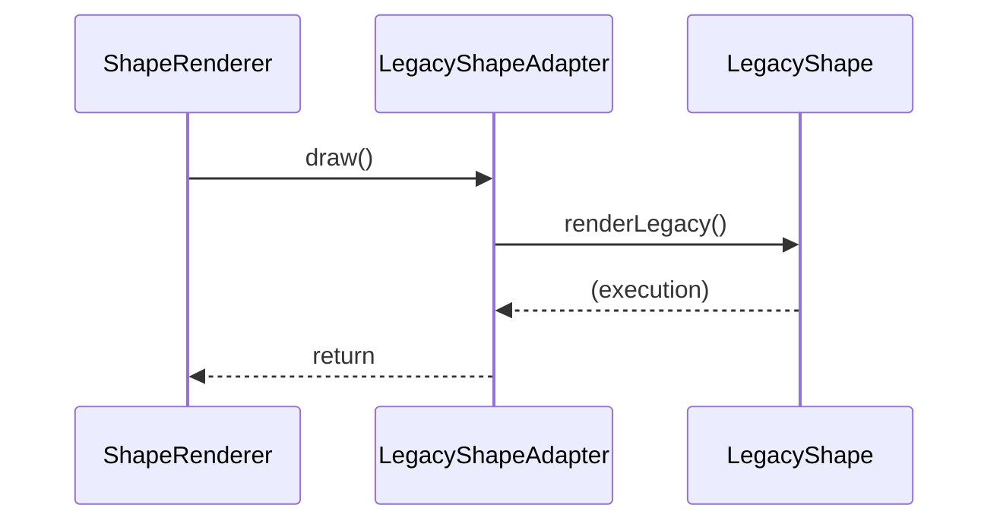

# 适配器模式 (Adapter Pattern)

## 模式定义
适配器模式是一种结构型设计模式，它允许接口不兼容的类能够一起工作。适配器通过将一个类的接口转换成客户端期望的另一个接口，使得原本由于接口不兼容而不能一起工作的类可以协同工作。

## 当前仓库实现概览
在当前 C++ 仓库中，适配器模式通过 `adapter_patterns.h` 实现，展示了如何将多种不同来源的图形系统（遗留系统、第三方库、现代数据驱动系统）统一到标准的 `Shape` 接口下。

### 核心类与职责
1.  **Target (目标接口)**: `Shape` 类，定义了客户端期望的标准接口（`draw`, `getType`, `getArea`, `printInfo`）。
2.  **Client (客户端)**: `ShapeRenderer` 类，仅通过 `Shape` 接口与各种图形对象交互。
3.  **Adaptee (被适配者)**:
    *   `LegacyShape`: 遗留系统的图形类，使用 `renderLegacy` 等过时方法。
    *   `ThirdPartyShape`: 第三方库的图形类，使用 `renderAsSVG` 等不同命名的接口。
    *   `ModernShapeData`: 现代数据结构，不具备成员函数，需要通过 `ModernShapeProcessor` 处理。
4.  **Adapter (适配器)**:
    *   `LegacyShapeAdapter`: 对象适配器，持有 `LegacyShape` 的实例。
    *   `ThirdPartyShapeAdapter`: 对象适配器，持有 `ThirdPartyShape` 的实例。
    *   `ModernShapeAdapter`: 将结构化数据适配为 `Shape` 对象。

## 当前实现如何工作
仓库采用了**对象适配器**模式。适配器类继承自目标接口 `Shape`，并在内部封装了一个被适配者的实例。当客户端调用 `Shape` 的方法时，适配器会将该请求转换为对被适配者特定接口的调用。

例如，在 `LegacyShapeAdapter` 中：
*   客户端调用 `draw()` -> 适配器内部调用 `legacyShape_->renderLegacy()`。
*   客户端调用 `getArea()` -> 适配器内部调用 `legacyShape_->calculateLegacyArea()`。

## Mermaid 图

### 类图


### 序列图


## 编译与运行
使用支持 C++14 或更高版本的编译器进行编译。

### 编译命令
```bash
g++ -std=c++14 test_adapter_pattern.cpp -o test_adapter_pattern
```

### 运行
```bash
./test_adapter_pattern
```

## 性能/内存分析方法
1.  **间接调用开销**: 适配器引入了一层额外的函数调用。在高性能图形渲染中，如果适配器位于紧凑循环内，可以通过内联（inline）或在编译期使用模板适配器（类适配器）来减少开销。
2.  **对象生命周期管理**: 当前实现使用 `std::unique_ptr` 管理被适配者的生命周期，确保在适配器销毁时，内部的被适配对象也能正确释放，避免内存泄漏。
3.  **内存占用**: 对象适配器比原始对象多出一个指针的开销（指向被适配者的指针）。

## 适用场景与权衡
*   **适用场景**:
    *   集成第三方库，但其接口与现有系统不匹配。
    *   复用旧系统的功能，同时又不希望修改旧系统的代码。
    *   需要创建一个通用的接口来处理多个不相关的类。
*   **权衡**:
    *   **优点**: 提高类的复用性；灵活性高；符合开闭原则。
    *   **缺点**: 过度使用会使系统变得复杂；增加了代码阅读成本（需要跳转多次才能看到真实逻辑）。
