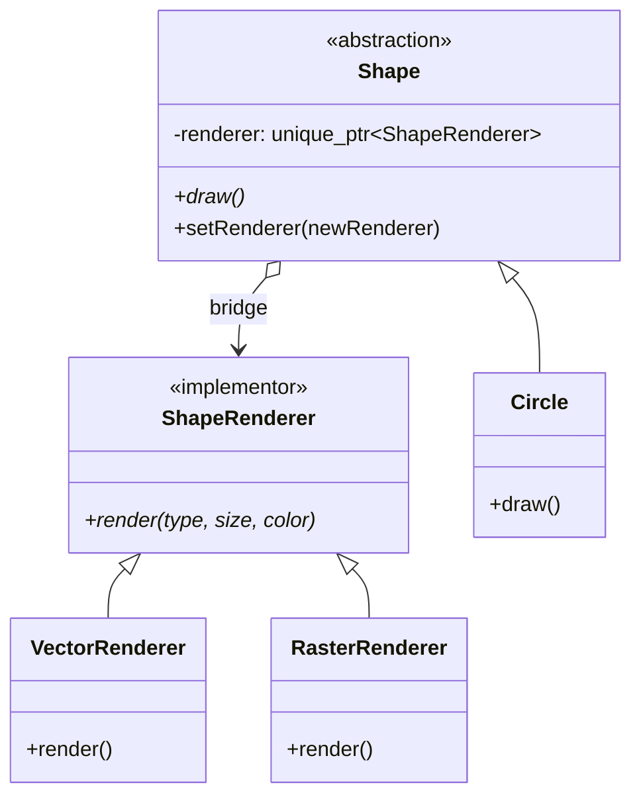
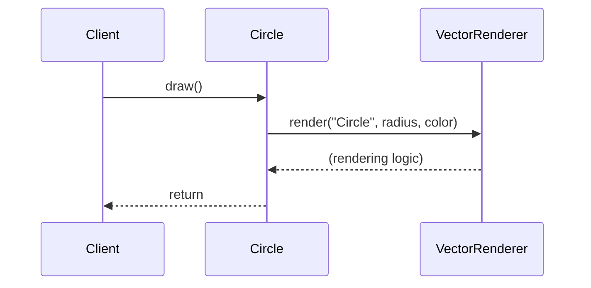

# 桥接模式 (Bridge Pattern)

## 模式定义
桥接模式是一种结构型设计模式，它的核心思想是将抽象部分（Abstraction）与实现部分（Implementation）分离，使它们可以独立地变化。通过组合而非继承的方式，桥接模式解决了多层继承带来的类爆炸问题。

## 当前仓库实现概览
在当前仓库中，桥接模式在 `bridge_patterns.h` 中通过图形形状（Shape）和渲染器（Renderer）的解耦来实现。

### 核心类与职责
1.  **Abstraction (抽象类)**: `Shape` 基类。它持有一个指向 `ShapeRenderer` 的指针。
2.  **Refined Abstraction (扩充抽象类)**: `Circle`, `Rectangle`, `Triangle`, `Polygon` 等。它们实现了具体的业务逻辑（如计算面积），并通过 `renderer_` 成员进行绘制。
3.  **Implementor (实现类接口)**: `ShapeRenderer` 基类，定义了渲染操作的接口（`render`）。
4.  **Concrete Implementor (具体实现类)**: `VectorRenderer`, `RasterRenderer`, `SVGRenderer`, `ModernRenderer`, `VintageRenderer` 等。它们提供了各种各样的绘制技术。

## 当前实现如何工作
`Shape` 对象（抽象）不再自己负责绘制，而是将绘制任务委托给关联的 `ShapeRenderer` 对象（实现）。

这种设计的优势在于：
*   **独立扩展**: 你可以增加新的形状（如 `Hexagon`）而不需要增加新的渲染器；也可以增加新的渲染器（如 `OpenGLRenderer`）而不需要修改现有的形状类。
*   **运行时切换**: 仓库中的 `Shape::setRenderer` 方法允许在程序运行时动态更换渲染后端。例如，从矢量渲染切换到位图渲染，而对象本身的属性（如半径、位置）保持不变。

## Mermaid 图

### 类图


### 序列图


## 编译与运行
### 编译命令
```bash
g++ -std=c++14 test_bridge_pattern.cpp -o test_bridge_pattern
```

### 运行
```bash
./test_bridge_pattern
```

## 性能/内存分析方法
1.  **解耦开销**: 每次调用 `draw()` 都会通过虚函数表跳转到 `renderer_->render()`。对于极高频率的渲染调用（如每秒数百万次），这可能成为瓶颈。
2.  **内存占用**: 每个 `Shape` 对象额外占用一个 `std::unique_ptr` 的空间。
3.  **动态切换分析**: 在 `test_bridge_pattern.cpp` 中，通过 `std::chrono` 测量了创建大量不同组合形状的时间，展示了该模式在处理复杂配置时的效率。

## 适用场景与权衡
*   **适用场景**:
    *   当一个类存在两个独立变化的维度（如形状和颜色、形状和平台）。
    *   不希望在抽象和它的实现之间有一个固定的绑定关系。
    *   类的继承层次过深，导致修改困难。
*   **权衡**:
    *   **优点**: 分离接口及其实现；提高可扩充性；实现细节对客户端透明。
    *   **缺点**: 增加了系统的理解和设计难度，需要在抽象层进行关联。
