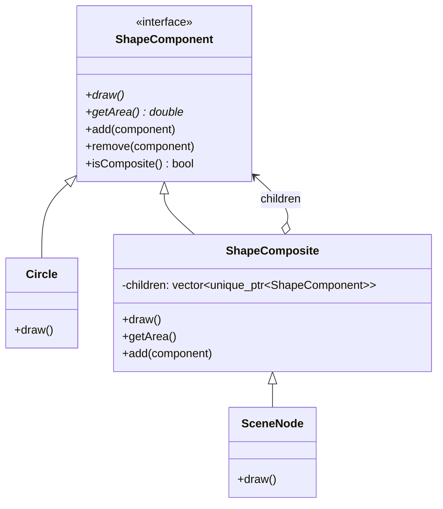
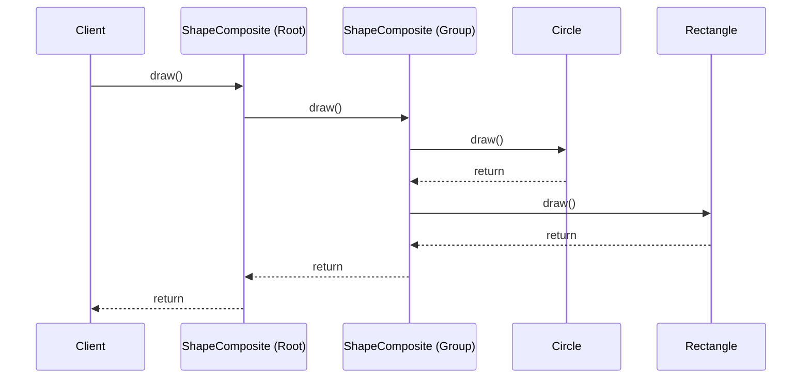

# 组合模式 (Composite Pattern)

## 模式定义
组合模式是一种结构型设计模式，你可以使用它将对象组合成树形结构，并且能像使用独立对象一样使用它们。它让客户端可以统一地处理单个对象和对象的组合。

## 当前仓库实现概览
在 `composite_patterns.h` 中，组合模式用于构建复杂的图形层次结构（如场景图、UI 布局）。

### 核心类与职责
1.  **Component (组件接口)**: `ShapeComponent` 类。定义了叶子节点和容器节点的共同接口（`draw`, `getArea`, `printInfo`），并提供了默认的容器操作（`add`, `remove`, `isComposite`）。
2.  **Leaf (叶子节点)**: `Circle`, `Rectangle`, `Triangle`, `Line` 等类。它们是树的末端节点，实现了具体的绘制逻辑，但不包含子节点。
3.  **Composite (容器节点)**:
    *   `ShapeComposite`: 基础容器类，持有 `std::vector<std::unique_ptr<ShapeComponent>>`。
    *   `Group`, `Layer`, `SceneNode`: 特化的容器类，支持嵌套、可见性控制、坐标偏移和缩放。
    *   `ComplexShapeComposite`: 预定义的复杂组合（如通过简单形状构建的 `House` 或 `Car`）。

## 当前实现如何工作
组合模式的核心在于**递归调用**。当你在 `ShapeComposite` 对象上调用 `draw()` 时，它会遍历其所有的子节点，并对每个子节点调用 `draw()`。如果某个子节点本身也是一个 `Composite`，它会继续向下递归，直到触及所有的叶子节点。

仓库实现的特点：
*   **透明性**: 接口 `ShapeComponent` 包含了管理子节点的方法（虽然叶子节点默认不执行任何操作），这使得客户端无需关心处理的是单个形状还是一个复杂的形状组。
*   **类型安全**: 通过 `isComposite()` 方法，客户端可以在必要时安全地检查对象是否为容器。

## Mermaid 图

### 类图


### 序列图


## 编译与运行
### 编译命令
```bash
g++ -std=c++14 test_composite_pattern.cpp -o test_composite_pattern
```

### 运行
```bash
./test_composite_pattern
```

## 性能/内存分析方法
1.  **深度递归开销**: 非常深的树结构可能导致栈溢出。当前实现在 `test_composite_pattern.cpp` 中通过创建 5 层深度、每层 3 个子节点的结构来测试性能。
2.  **内存管理**: 使用 `unique_ptr` 确保了整棵树的生命周期管理是自动化的。销毁根节点时，所有子节点也会被级联销毁。
3.  **计算属性**: `getArea()` 是一个递归操作。如果树结构频繁变动，可以考虑在 `Composite` 中缓存计算结果（Memoization）。

## 适用场景与权衡
*   **适用场景**:
    *   需要表示对象的“部分-整体”层次结构。
    *   希望客户端忽略组合对象与单个对象的不同，统一地使用组合结构中的所有对象。
*   **权衡**:
    *   **优点**: 定义了包含基本对象和组合对象的类层次结构；简化了客户端代码；更容易增加新类型的组件。
    *   **缺点**: 使设计变得更加抽象；很难限制组合中的组件类型（例如，很难在编译期限制某个 `Group` 只能包含 `Circle`）。
