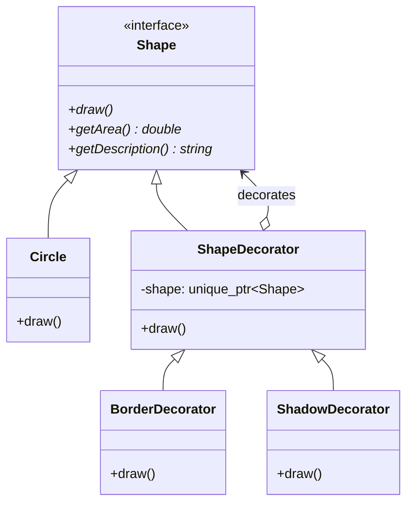
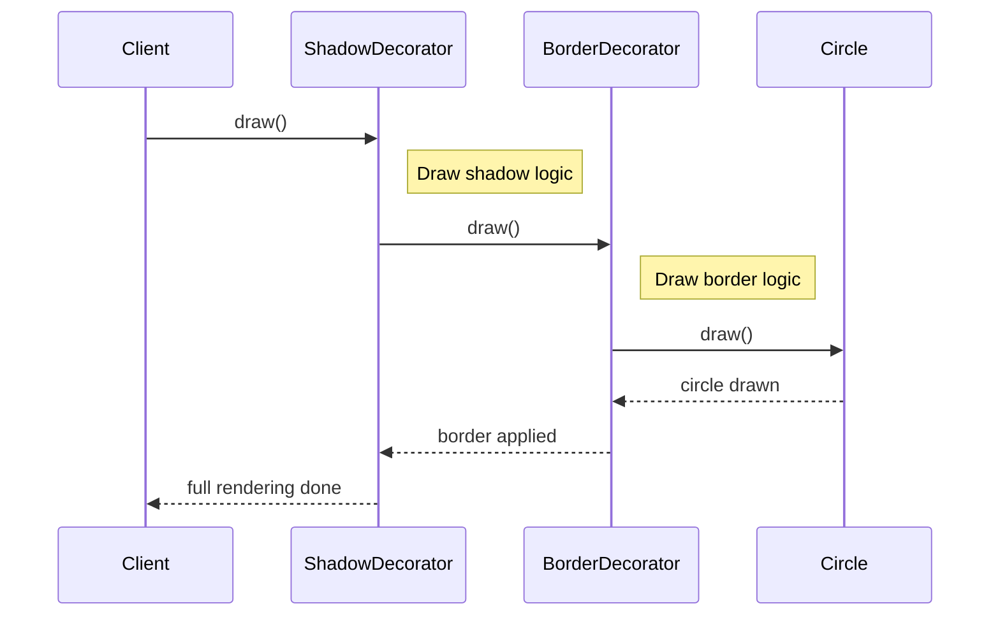

# 装饰器模式 (Decorator Pattern)

## 模式定义
装饰器模式是一种结构型设计模式，允许你通过将对象放入包含行为的特殊封装对象中来为原对象绑定新的行为。装饰器模式相比继承更加灵活，因为它可以在运行时动态地添加或删除功能。

## 当前仓库实现概览
在 `decorator_patterns.h` 中，装饰器模式用于在不修改原始图形类的情况下，为图形对象动态添加边框、阴影、填充、渐变、缩放和动画等视觉效果。

### 核心类与职责
1.  **Component (组件接口)**: `Shape` 类。定义了装饰器和被装饰对象共有的接口（`draw`, `getArea`, `getDescription`）。
2.  **Concrete Component (具体组件)**: `Circle`, `Rectangle`, `Triangle` 等基础形状类。
3.  **Decorator (装饰器基类)**: `ShapeDecorator` 类。它实现了 `Shape` 接口，并持有一个指向 `Shape` 对象的私有指针。
4.  **Concrete Decorators (具体装饰器)**:
    *   `BorderDecorator`: 添加边框效果。
    *   `FillDecorator`: 添加颜色填充。
    *   `ShadowDecorator`: 添加阴影效果。
    *   `GradientDecorator`: 添加渐变色。
    *   `AnimationDecorator`: 添加动画行为。
    *   `ScaleDecorator`: 改变形状大小（同时影响 `getArea()` 的计算结果）。
5.  **Utilities (辅助工具)**:
    *   `FluentDecorator`: 提供流式接口（Chaining），方便链式调用装饰器。
    *   `DecoratorFactory`: 提供静态方法快速创建装饰组合。

## 当前实现如何工作
装饰器通过**层层嵌套**来工作。每个装饰器在调用被封装对象的方法之前或之后，执行自己的额外逻辑。

例如，一个带有阴影和边框的圆形的调用链如下：
`ShadowDecorator::draw()` -> `BorderDecorator::draw()` -> `Circle::draw()`。

仓库实现的亮点：
*   **流式接口**: `FluentDecorator` 极大地提高了代码的可读性，避免了深层嵌套的构造函数调用。
*   **属性累加**: `ScaleDecorator` 展示了装饰器如何不仅能增加视觉效果，还能修改核心计算属性（如嵌套缩放时的面积累乘）。

## Mermaid 图

### 类图


### 序列图


## 编译与运行
### 编译命令
```bash
g++ -std=c++14 test_decorator_pattern.cpp -o test_decorator_pattern
```

### 运行
```bash
./test_decorator_pattern
```

## 性能/内存分析方法
1.  **对象头开销**: 每个装饰器都是一个独立的对象，包含一个虚函数表指针和一个指向子对象的指针。长装饰链会增加内存消耗。
2.  **递归调用**: 每一层装饰都增加了一次虚函数调用开销。对于性能敏感的渲染循环，建议使用 `CompoundDecorator`（仓库中已提供）将多个效果合并到一个类中，以减少跳转。
3.  **内存管理**: 仓库使用 `std::unique_ptr` 级联管理所有装饰器。当最外层装饰器析构时，整个装饰链都会被自动安全释放。

## 适用场景与权衡
*   **适用场景**:
    *   在不影响其他对象的情况下，以动态、透明的方式给单个对象添加职责。
    *   处理可以撤销的职责。
    *   当不能采用继承的方式进行扩充时（例如，类定义被隐藏，或继承导致类爆炸）。
*   **权衡**:
    *   **优点**: 比继承更灵活；可以组合出大量的功能子集；符合单一职责原则。
    *   **缺点**: 产生许多小对象；排错困难（需要穿过层层装饰）。
