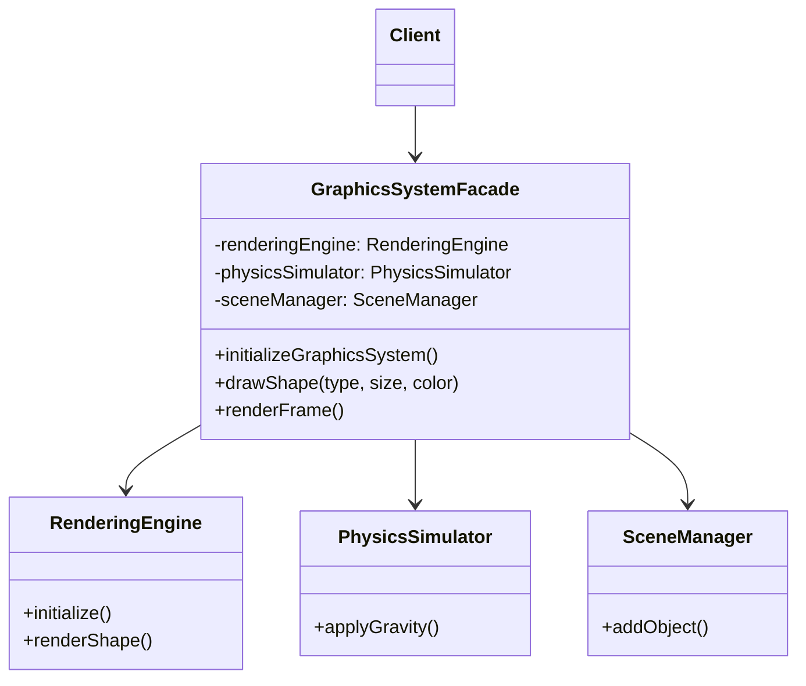
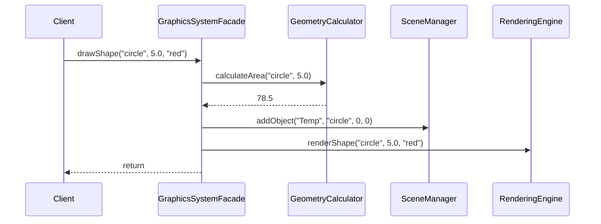

# 外观模式 (Facade Pattern)

## 模式定义
外观模式是一种结构型设计模式，能为复杂子系统提供一个统一且简化的接口。外观模式定义了一个高层接口，这个接口使得这一子系统更加容易使用。

## 当前仓库实现概览
仓库在 `graphics_facade.h` 中实现了一个复杂的图形渲染系统外观。它封装了渲染引擎、物理模拟、资源管理、场景管理等多个子系统。

### 核心类与职责
1.  **Facade (外观类)**:
    *   `GraphicsSystemFacade`: 通用图形系统外观，提供 `initializeGraphicsSystem`, `drawShape`, `renderFrame` 等高层方法。
2.  **Specialized Facades (特化外观)**:
    *   `GameDevelopmentFacade`: 针对游戏开发的简化接口，包含游戏循环和实体创建。
    *   `UIDevelopmentFacade`: 针对 UI 开发的简化接口，禁用物理引擎，专注于按钮和文本创建。
    *   `AnimationProductionFacade`: 针对动画制作的简化接口，专注于序列帧渲染和导出。
3.  **Subsystems (子系统)**:
    *   `RenderingEngine`: 负责底层图形渲染。
    *   `PhysicsSimulator`: 处理重力和速度计算。
    *   `AnimationController`: 控制位置、缩放和颜色的动画。
    *   `SceneManager`: 管理场景中的对象。
    *   `ResourceManager`: 处理资源预加载和释放。
    *   `GeometryCalculator`: 计算几何属性（面积、包围盒）。
    *   `InputHandler`: 处理鼠标和键盘输入。

## 当前实现如何工作
外观类 `GraphicsSystemFacade` 组合了所有子系统的实例。当客户端调用外观的一个简单方法（如 `drawShape`）时，外观内部会按顺序调度多个子系统的操作：
1.  调用 `GeometryCalculator` 计算面积和包围盒。
2.  调用 `SceneManager` 将对象添加到场景中。
3.  调用 `RenderingEngine` 进行实际渲染。

客户端不需要知道这些子系统的存在，也不需要了解它们之间复杂的协作逻辑。

## Mermaid 图

### 类图


### 序列图


## 编译与运行
### 编译命令
```bash
g++ -std=c++14 test_facade_pattern.cpp -o test_facade_pattern
```

### 运行
```bash
./test_facade_pattern
```

## 性能/内存分析方法
1.  **分层开销**: 外观模式引入了一层额外的函数转发，但这种开销通常可以忽略不计，相比于它带来的代码整洁度提升。
2.  **资源集中管理**: 通过外观类的 `initialize` 和 `shutdown` 方法，可以确保所有子系统的资源被以正确的顺序初始化和释放，避免内存泄漏和竞态条件。
3.  **按需调用**: 特化外观（如 `UIDevelopmentFacade`）可以主动关闭不必要的子系统（如物理模拟），从而优化整体内存占用和 CPU 消耗。

## 适用场景与权衡
*   **适用场景**:
    *   为一个复杂子系统提供一个简单接口。
    *   子系统相对独立，需要通过外观进行解耦。
    *   构建多层结构的系统时，使用外观作为每层的入口。
*   **权衡**:
    *   **优点**: 减少了客户端处理的对象数目；实现了子系统与客户端之间的松耦合；符合迪米特法则（最少知识原则）。
    *   **缺点**: 如果不慎，外观类可能成为“上帝对象”（God Object），承担过多职责；外观类内部的修改可能需要波及多个子系统。
