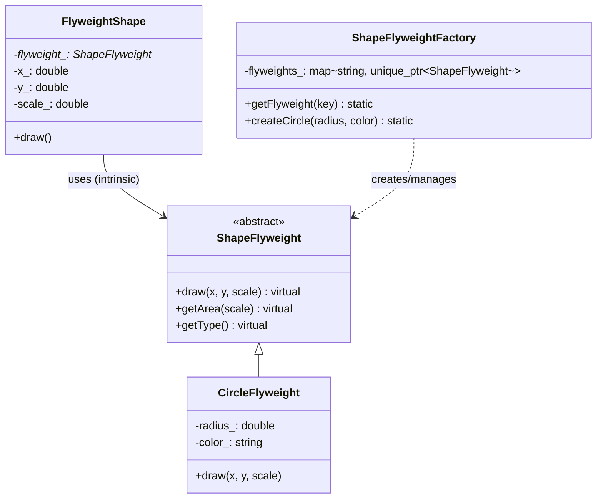
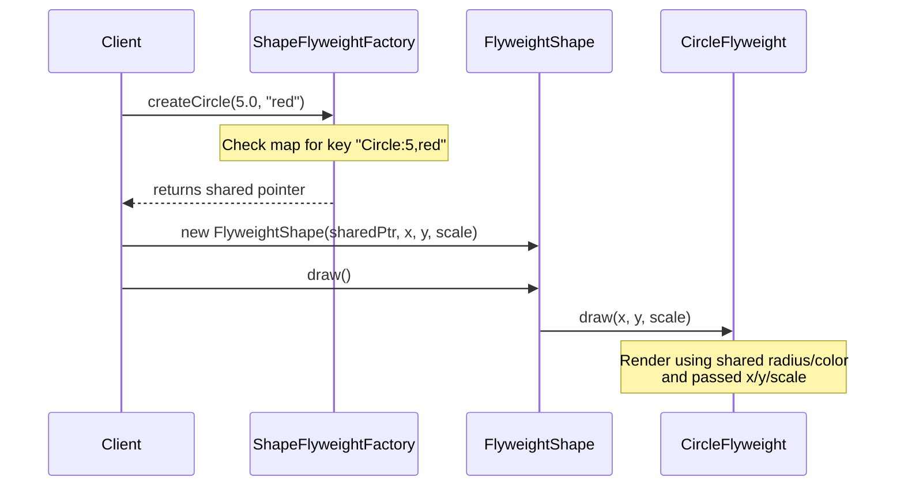

# 享元模式 (Flyweight Pattern)

## 模式定义
享元模式通过共享多个对象所共有的状态，以便在有限的内存中支持大量细粒度的对象。它将对象的状态分为：
- **内部状态 (Intrinsic State)**：存储在享元对象内部，不随环境改变而改变，可以共享（如形状的类型、颜色等）。
- **外部状态 (Extrinsic State)**：随环境改变而改变，不能共享，由客户端在调用享元操作时传入（如形状的位置、缩放比例等）。

## 当前仓库实现概览
本仓库在 `flyweight_shapes.h` 中实现了一个图形系统，展示了如何通过享元模式管理数千个具有相似属性（颜色、基础尺寸）的几何图形，同时保持极低的内存占用。

### 核心类与职责
1.  **`ShapeFlyweight` (享元接口)**：定义了图形的通用操作接口（如 `draw`, `getArea`），并接收外部状态（坐标、缩放）。
2.  **`CircleFlyweight`, `RectangleFlyweight`, `TriangleFlyweight` (具体享元)**：存储内部状态（如半径、宽、高、颜色）。这些对象是由工厂管理的共享单例。
3.  **`ShapeFlyweightFactory` (享元工厂)**：核心组件，使用 `std::unordered_map` 维护享元池。根据请求的内部属性（Key）返回现有对象或创建新对象。
4.  **`FlyweightShape` (享元包装类/上下文)**：持有指向共享享元对象的指针，并存储该实例特有的外部状态（`x`, `y`, `scale`）。
5.  **`FlyweightShapeSystem` / `OptimizedFlyweightManager` (客户端/管理器)**：负责创建大量 `FlyweightShape` 并进行统一渲染或性能优化。

## 当前实现如何工作

### 1. 状态分离
- **内部状态**：封装在 `ShapeFlyweight` 的派生类中（如 `CircleFlyweight` 存储 `radius_` 和 `color_`）。
- **外部状态**：存储在 `FlyweightShape` 中（`x_`, `y_`, `scale_`），在调用 `draw()` 时传递给享元对象。

### 2. 对象共享逻辑
工厂类 `ShapeFlyweightFactory` 通过字符串 Key（例如 `"Circle:5.000000,red"`）来唯一标识一个享元。
- 如果请求的图形属性组合已存在，工厂直接返回现有指针。
- 如果不存在，则创建新对象并存入 map。

### 3. 主动管理
通过 `ShapeFlyweightFactory::reset()` 可以清空享元池，确保在系统重置时资源得到正确释放。

## Mermaid 图表

### 类图


### 序列图（渲染过程）


## 编译与运行
使用 C++11 或更高版本编译器：

```bash
g++ -std=c++14 test_flyweight_pattern_final.cpp -o flyweight_demo
./flyweight_demo
```

## 性能/内存分析方法

### 1. 内存节省验证
在 `test_flyweight_pattern_final.cpp` 中，通过以下方式验证：
- `ShapeFlyweightFactory::getFlyweightCount()`：查看实际创建的对象数量。
- 创建 5000 个图形对象，如果只有 12 种属性组合，则实际享元对象仅为 12 个，节省了约 99.7% 的几何属性内存开销。

### 2. 耗时对比
演示程序包含了直接创建 vs 享元模式的耗时对比：
- **直接创建**：频繁分配内存。
- **享元模式**：由于重复使用对象，减少了堆分配次数，通常在大量对象创建时表现更优。

### 3. 性能优化建议
- **Key 设计**：本实现使用字符串拼接作为 Key。在高并发场景下，可以考虑使用哈希值或复合结构体作为 Key 以减少字符串操作开销。
- **预热加载**：对于常见的图形配置，可以在系统启动时预先填充享元池。

## 适用场景与权衡

### 优点
- **极大降低内存消耗**：在处理成千上万个细粒度对象（如森林中的树、游戏中的子弹、文本编辑器的字符）时效果显著。
- **减少 GC 压力/内存管理负担**：对象数量少，管理更集中。

### 权衡
- **代码复杂度增加**：需要分离状态并引入工厂类。
- **运行时开销**：传递外部状态（Context）会增加微小的函数调用开销，且 Key 的查找（Map lookup）需要时间。
- **不适用于状态经常变动的内部属性**：如果内部状态也频繁改变，则不再适合共享。
