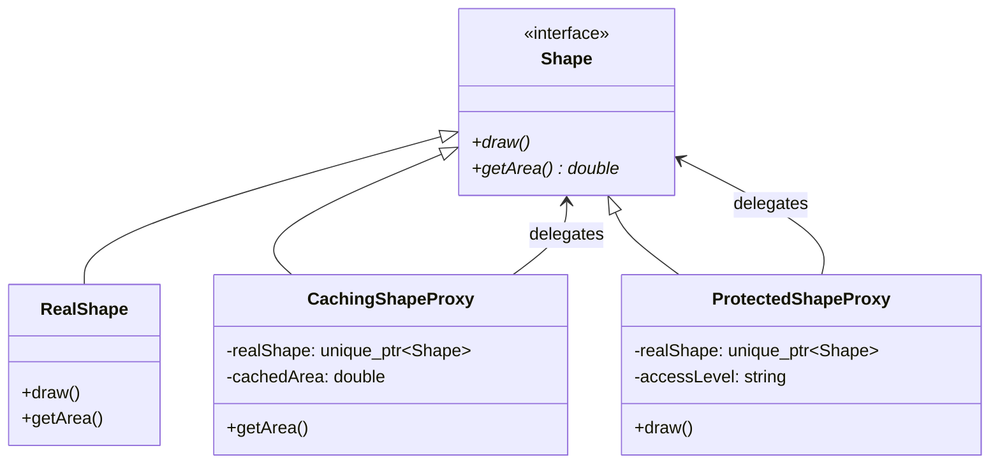
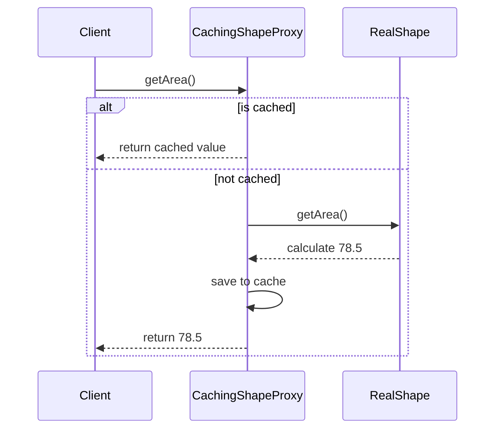

# 代理模式 (Proxy Pattern)

## 模式定义
代理模式是一种结构型设计模式，让你能够提供对象的替代品或占位符。代理控制着对于原对象的访问，并允许在将请求提交给对象前后进行一些处理。

## 当前仓库实现概览
在 `proxy_shapes.h` 中，仓库展示了多种不同类型的代理实现，统一工作在 `Shape` 接口下。

### 核心类与职责
1.  **Subject (抽象主题接口)**: `Shape` 类。定义了真实对象和代理对象的共同接口。
2.  **Real Subject (真实主题)**: `Circle`, `Rectangle`, `Triangle` 等基础形状类。
3.  **Proxy (代理类)**:
    *   `LoggingShapeProxy`: **日志代理**。记录所有操作的调用时间、方法名和结果。
    *   `CachingShapeProxy`: **缓存代理**。对于耗时的计算操作（如 `getArea()`），在第一次计算后缓存结果，后续调用直接返回缓存值。
    *   `ProtectedShapeProxy`: **保护代理**。基于访问级别（如 admin, user, guest）控制对真实对象的访问。
    *   `RemoteShapeProxy`: **远程代理模拟**。模拟通过网络访问远程服务器上的对象，包含网络延迟模拟（`sleep_for`）。

## 当前实现如何工作
代理类通过组合方式持有真实对象的指针（`std::unique_ptr<Shape> realShape_`）。客户端与代理进行交互，代理根据其类型执行额外的逻辑，然后决定是否以及何时调用真实对象的方法。

仓库实现亮点：
*   **透明性**: 所有的代理类都继承自 `Shape`，因此它们可以被传递给任何期望 `Shape` 对象的函数（如 `ShapeRenderer`），客户端无需感知代理的存在。
*   **代理链 (Proxy Chaining)**: 由于代理和真实对象实现了相同的接口，你可以将多个代理嵌套在一起。例如：`LoggingProxy(CachingProxy(ProtectedProxy(RealShape)))`。

## Mermaid 图

### 类图


### 序列图 (缓存代理)


## 编译与运行
### 编译命令
```bash
g++ -std=c++14 test_proxy_pattern_corrected.cpp -o test_proxy_pattern
```

### 运行
```bash
./test_proxy_pattern
```

## 性能/内存分析方法
1.  **缓存命中率**: 在 `test_proxy_pattern_corrected.cpp` 中，通过循环调用 1000 次 `getArea()` 演示了缓存代理相比直接计算的巨大性能优势（微秒级对比）。
2.  **延迟模拟**: `RemoteShapeProxy` 通过 `std::this_thread::sleep_for` 展示了远程调用对系统响应时间的影响，这对于 UI 线程设计非常重要。
3.  **权限控制成本**: `ProtectedShapeProxy` 在每次调用前进行字符串比较或权限检查，虽然有轻微开销，但保证了系统的安全性。

## 适用场景与权衡
*   **适用场景**:
    *   **延迟初始化 (虚拟代理)**: 只有在真正需要时才创建开销大的对象。
    *   **访问控制 (保护代理)**: 仅允许特定权限的用户访问对象。
    *   **本地执行远程服务 (远程代理)**: 隐藏对象位于不同地址空间的事实。
    *   **记录日志 (日志代理)**: 透明地记录操作历史。
    *   **缓存结果 (缓存代理)**: 存储昂贵操作的结果。
*   **权衡**:
    *   **优点**: 可以在不修改真实对象的情况下控制它；符合开闭原则。
    *   **缺点**: 增加了系统的复杂性；由于增加了代理层，请求的处理速度可能会变慢（特别是远程代理）。
