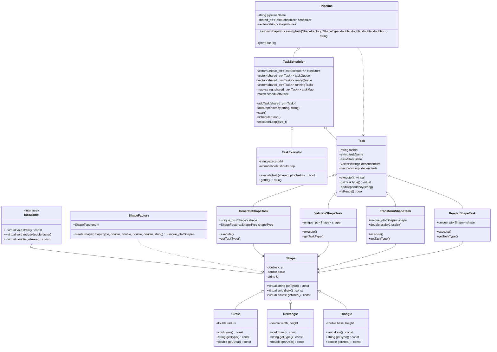
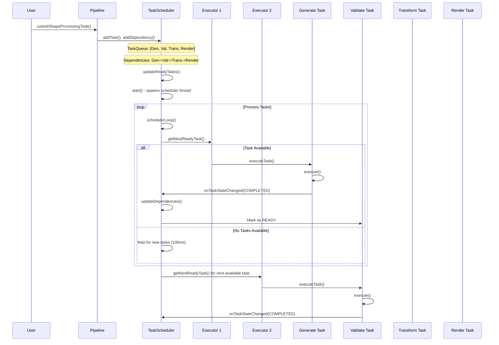
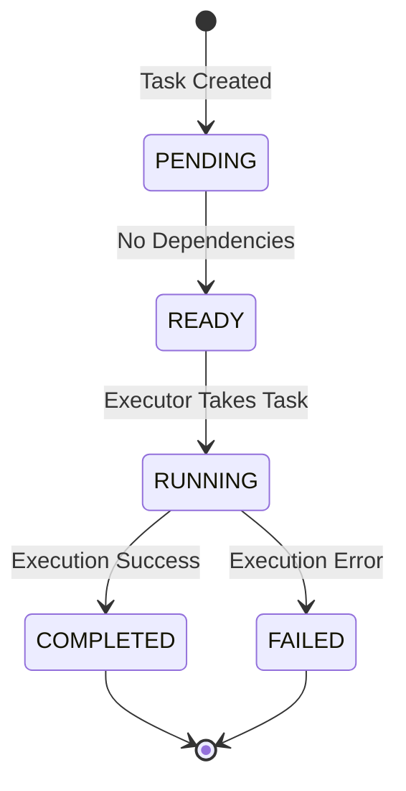
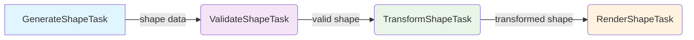
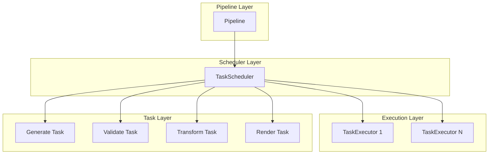

# Pipeline Scheduler System Architecture

## System Overview

The Pipeline Scheduler System is a concurrent task processing system that manages tasks through a pipeline architecture with scheduler and executor components.

## Class Relationships

## Multi-threading Flow Diagram

## Task State Machine

## Data Flow Between Tasks

## Component Interaction Overview

